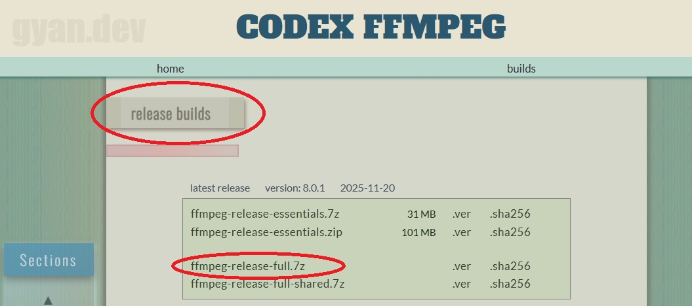
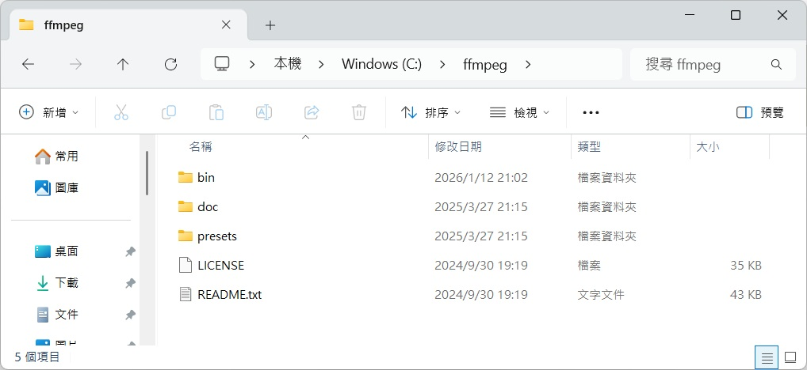
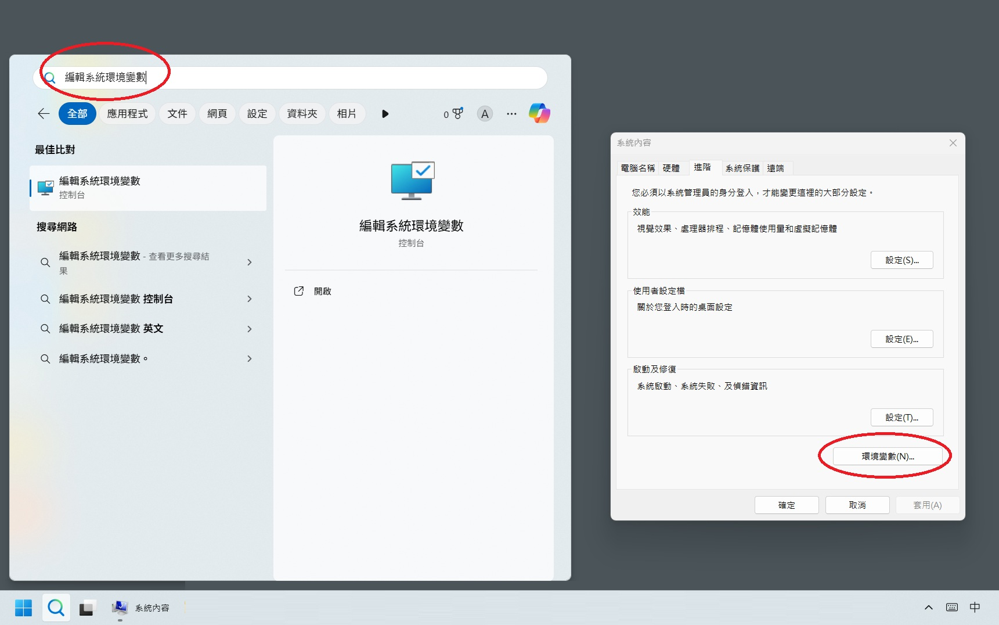
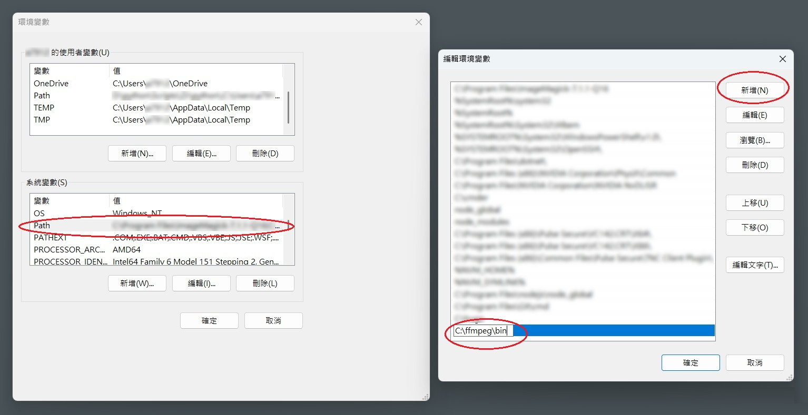

為什麼要安裝 FFmepg？
- 因為開源、彈性大
- 因為轉檔、分析、播放、剪接、字幕、濾鏡都做得到

<!-- more -->

### 安裝步驟
1. 前往 [gyan.dev](https://www.gyan.dev/ffmpeg/builds/) 下載
往下拉到 release builds 的區塊
點擊 `ffmpeg-release-full.7z` 下載

<div align="center"></div>

2. 解壓縮資料夾後，修改資料夾名稱為 `ffmpeg`

3. 將資料夾放到以下路徑 `C:\ffmpeg`

<div align="center"></div>

4. 搜尋 `編輯系統環境變數` 並開啟，點擊 `環境變數`

<div align="center"></div>

雙擊下方 `系統變數` 區塊的 `Path`，開啟 `編輯環境變數`視窗
點擊 `新增`，輸入 `C:\ffmpeg\bin` > `確定`

<div align="center"></div>

5. 開啟 CMD，輸入 `set PATH=C:`，讓環境變數立即生效，不用重開機
6. 關閉 CMD 再重啟，輸入 `echo %PATH%`，查看是否有增加 `C:\ffmpeg\bin`
7. 在 CMD 或 Cmder 輸入 `ffmpeg -version`，檢查是否安裝成功
```
$ ffmpeg -version
ffmpeg version 4.2.1 Copyright (c) 2000-2019 the FFmpeg developers
built with gcc 9.1.1 (GCC) 20190807
configuration: --enable-gpl --enable-version3 --enable-sdl2 --enable-fontconfig --enable-gnutls --enable-iconv --enable-libass --enable-libdav1d --enable-libbluray --enable-libfreetype --enable-libmp3lame --enable-libopencore-amrnb --enable-libopencore-amrwb --enable-libopenjpeg --enable-libopus --enable-libshine --enable-libsnappy --enable-libsoxr --enable-libtheora --enable-libtwolame --enable-libvpx --enable-libwavpack --enable-libwebp --enable-libx264 --enable-libx265 --enable-libxml2 --enable-libzimg --enable-lzma --enable-zlib --enable-gmp --enable-libvidstab --enable-libvorbis --enable-libvo-amrwbenc --enable-libmysofa --enable-libspeex --enable-libxvid --enable-libaom --enable-libmfx --enable-amf --enable-ffnvcodec --enable-cuvid --enable-d3d11va --enable-nvenc --enable-nvdec --enable-dxva2 --enable-avisynth --enable-libopenmpt
libavutil      56. 31.100 / 56. 31.100
libavcodec     58. 54.100 / 58. 54.100
libavformat    58. 29.100 / 58. 29.100
libavdevice    58.  8.100 / 58.  8.100
libavfilter     7. 57.100 /  7. 57.100
libswscale      5.  5.100 /  5.  5.100
libswresample   3.  5.100 /  3.  5.100
libpostproc    55.  5.100 / 55.  5.100
```

### 參考資料
- [How to Install FFmpeg on Windows 10 & Add FFmpeg to Windows Path](https://windowsloop.com/install-ffmpeg-windows-10/)
- [ffmpeg – Windows 安裝](http://jsnwork.kiiuo.com/archives/2705/ffmpeg-windows-%E5%AE%89%E8%A3%9D/)
