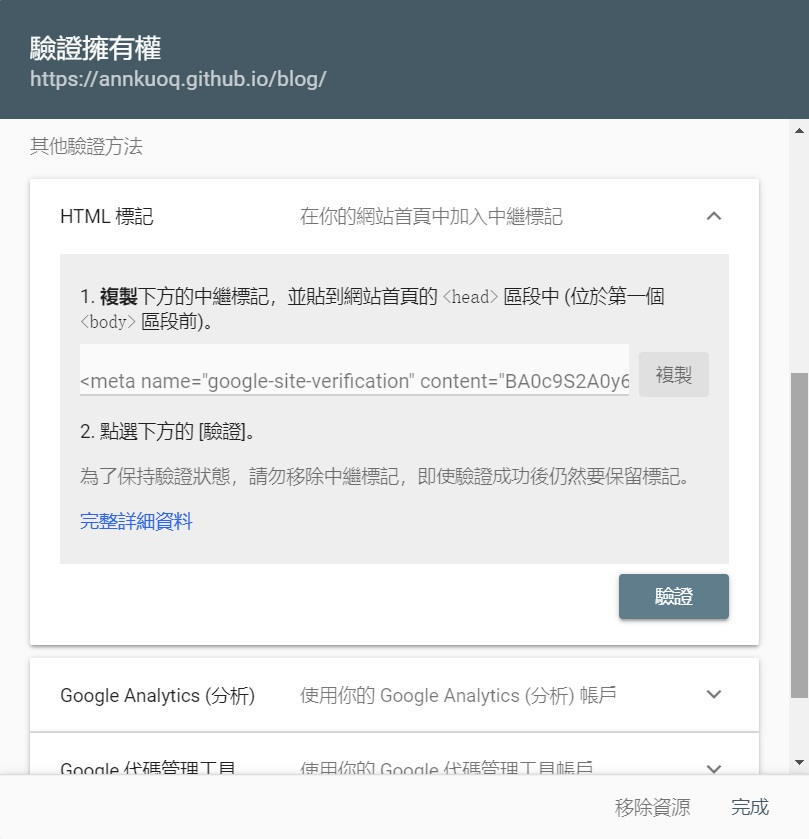
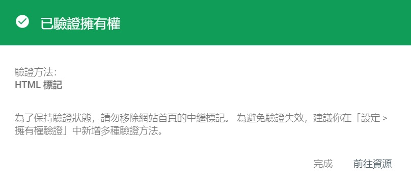

首先要先了解 Google 搜尋是怎麼運作的
其實 Google 不是搜尋整個網路
而是在搜尋 Google 的網頁索引 (index)

<!-- more -->

## Google 搜尋的運作方式

有三個步驟:
- Crawling 抓取
- Indexing 建立索引
- Serving and Ranking 傳回搜尋結果和排名

### 1. Crawling 抓取
因為網頁沒有統一登錄的地方
所以 Google 會透過稱為 Crawlers 的自動化程式來抓取網路上的內容
再將這些網頁所含的資料傳回 Google 伺服器

### 2. Indexing 建立索引
Google 的系統在分析網頁的內容後 (文字、圖片、影片等)
就會將這些資料編目到 Google 索引中
就像書末索引一樣
Google 會為網頁中的每個字詞建立條目

### 3. Serving and Ranking 傳回搜尋結果和排名
因為搜尋結果太多了
所以 Gooogle 會用演算法排名
例如關鍵字出現頻率、或使用者所在位置、以前的搜尋紀錄等等

> 想更了解 Google 搜尋的運作方式 [可點我](https://www.google.com/intl/zh-TW/search/howsearchworks/)

現在我們知道了 Google 其實是在搜尋 index
所以你有兩個選擇:
1. 等 Google Crawlers 爬到你且建好索引的那一天
2. 直接把網頁內容告訴 Google

看起來當然是直接告訴 Google 比較快～

## 使用 Search Console
[Search Console](https://search.google.com/search-console/about) 是 Google 的服務
我們把網站交給它之後
就可以搜尋到自己的部落格囉！

### 安裝步驟
1. 登入 Google 並前往 [Search Console](https://search.google.com/search-console/about) > `立即開始`

2. 選擇要新增的網站資源
  - `網域`: 必須進行 DNS 驗證
  - `網址前置字元`: 支援多種驗證方式

因為我是用 [GitHub Pages](https://pages.github.com/) 架站，並沒有買網域，所以用 `網址前置字元`
接著輸入包含`通訊協定`和`子網域`的完整網址: `https://annkuoq.github.io/blog/`

3. 驗證我擁有這個網站
Google 提供了多種驗證方法:
  - 上傳 HTML 檔案
  - HTML 標記
  - DNS 紀錄
  - Google Analytics (分析) 追蹤程式碼
  - Google 代碼管理工具容器片段
  - Google 協作平台
  - Blogger
  - Google Domains

我是用 `HTML 標記` 的方式
把 `<meta> tag` 貼到 `\themes\你的主題名稱\layout\_partia\head.ejs`

<div align="center"></div>

- 儲存 `.head.ejs`
- 清除快取和舊的靜態檔案
- 重新產生靜態檔案與部署網站
```
$ hexo clean
$ hexo g
$ hexo d
```
- 點擊 `驗證` 鈕後就成功囉～

<div align="center"></div>

### 測試搜尋結果

過幾天後，搜尋 `site:https://annkuoq.github.io/blog/`
看見自己的網站出現太感人了 😭

## Sitemap 網站地圖
除了給 Google 網址
也可以提供 Sitemap (網站地圖)
它會列出所有頁面 URL 和 metadata
讓搜尋引擎更有效的完整抓取網站

標準的 XML Sitemap 範例:
```
<?xml version="1.0" encoding="UTF-8"?>
<urlset xmlns="http://www.sitemaps.org/schemas/sitemap/0.9">
   <url>
      <loc>http://www.example.com/</loc>
      <lastmod>2005-01-01</lastmod>
      <changefreq>monthly</changefreq>
      <priority>0.8</priority>
   </url>
</urlset> 
```
> 想了解上面那些 tag 的用意 [可點我](https://www.sitemaps.org/zh_TW/protocol.html)

### 如何產生 Sitemap
#### 1. 線上產生器
網路上有很多免費 Sitemap 線上產生器
例如 [XML-Sitemaps](https://www.xml-sitemaps.com/)
1. 在根目錄的 `_config.yml ` 加上設定
```
sitemap:
  path: sitemap.xml
```
2. 清除快取和舊的靜態檔案
重新產生靜態檔案與部署網站
```
$ hexo clean
$ hexo g
$ hexo d
```
3. 到 [XML-Sitemaps](https://www.xml-sitemaps.com/) 輸入網址 > `START`
4. `View Sitemap Details` > `Download Your XML Sitemap File`
5. 把 `sitemap.xml` 上傳到根目錄 (GitHub Repo)

#### 2. 第三方套件
有一個叫 [hexo-generator-sitemap](https://www.npmjs.com/package/hexo-generator-sitemap) 的套件
能讓你的 Sitemap 和靜態檔案同時產生
1. 安裝套件 
```
$ npm install hexo-generator-sitemap --save
```
2. 在根目錄的 `_config.yml ` 加上設定
```
sitemap:
  path: sitemap.xml
```
3. 清除快取和舊的靜態檔案
產生靜態檔案和 Sitemap
重新部署網站
```
$ hexo clean
$ hexo g
$ hexo d
```

### 提交 Sitemap
1. 前往 Search Console 主控台
2. 點擊左側欄位中的 `Sitemap`
3. 輸入 `sitemap.xml`
4. 點擊 `提交`

## 新增或修改網頁內容
如果之後有新增網頁或修改內容
可以重新提交 Sitemap
或請 Search Console 重新檢索
1. 點擊左側的 `網址審查`
2. 輸入網址
3. 點擊 `要求建立索引`

## 參考資料
- [Search Console 官方文件](https://support.google.com/webmasters?hl=zh-Hant#topic=9128571)
- [Google Search Console 初學者指南，如何使用及安裝](https://www.yesharris.com/search-console-intro/)
- [為什麼搜尋 (Google) 不到我的 Hexo 部落格？](https://jenifers001d.github.io/2019/12/09/SEO/SEO1-Website-is-Not-Showing-in-Google-Search/)