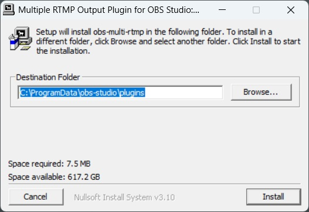
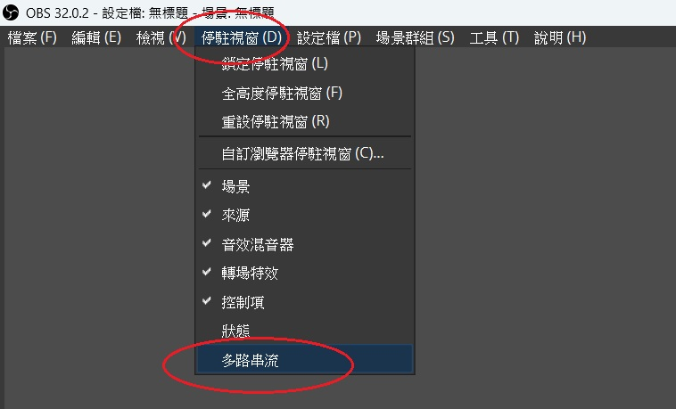
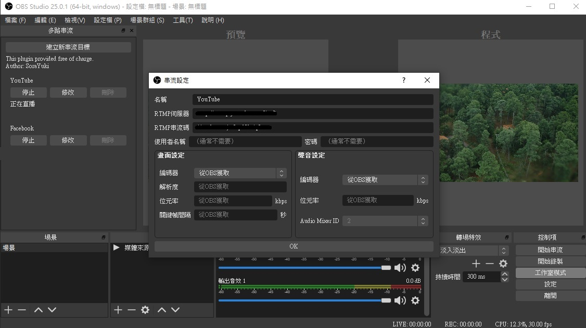
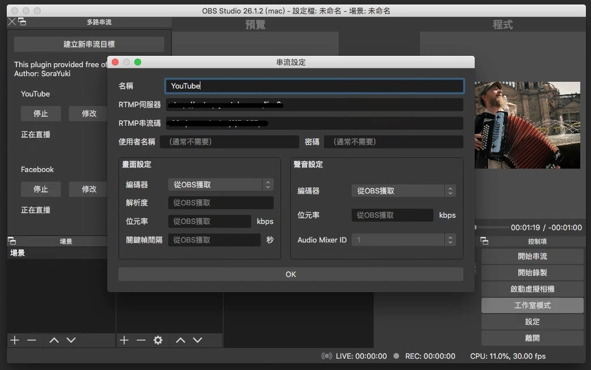

OBS 預設只能直播一個平台
但我需要同時直播 YouTube 和 Facebook
所以這陣子都在搜尋有沒有什麼好的解決方法

<!-- more -->

例如
- 開兩個 OBS (兩個 OBS 的設定可能會打架)
- 用第三方軟體: Restream, Straas (未來可能改為收費)
- 自架伺服器: Nginx (學習門檻較高)

在心灰意冷的時候看到 [OBS Forum](https://obsproject.com/forum/resources/multiple-rtmp-outputs-plugin.964/) 上有人做了 Plug-in
話不多說就趕快開始吧！

## Windows 安裝
1. 到 [GitHub Releases 頁面](https://github.com/sorayuki/obs-multi-rtmp/releases/)，依照自己的作業系統下載安裝檔後，解壓縮執行安裝
我是選擇 `obs-multi-rtmp-0.7.3.0-windows-x64-Installer.exe`

2. 打開 OBS，介面左上角會出現一個 `多路串流` 的區塊
如果沒有出現，可以點擊 `停駐視窗` > `多路串流`

4. 點擊 `建立新串流目標` > 輸入`名稱`、`URL`、`串流金鑰`等設定 > `確定`

5. 點擊 `開始` 送直播訊號

## Windows 解除安裝
1. 打開檔案總管，到 `C:\ProgramData\obs-studio\plugins`
2. 刪除 `obs-multi-rtmp` 資料夾

## Mac 安裝

1. 到 [GitHub Releases 頁面](https://github.com/sorayuki/obs-multi-rtmp/releases/)，依照自己的作業系統下載安裝檔，Mac 請選擇 `.pkg`

2. 點兩下執行安裝
若顯示 `無法打開 XXX，因為它來自未識別的開發者`
就要去 `系統偏好設定` > `安全性與隱私` > 點擊 `強制打開`

3. 打開 OBS，介面左上角會出現一個 `多路串流` 的區塊
如果沒有出現，可以點擊 `停駐視窗` > `多路串流`

4. 點擊 `建立新串流目標` > 輸入`名稱`、`伺服器`、`串流碼`等設定 > `OK`
5. 點擊 `開始` 送直播訊號

## 補充
這個套件可以單獨停止或開始某路直播
也可以個別設定解析度和編碼格式
不過要注意電腦效能和網速能承受的量

## 參考資料
- [Multiple RTMP outputs plugin | OBS Forums](https://obsproject.com/forum/resources/multiple-rtmp-outputs-plugin.964/)
- [sorayuki/obs-multi-rtmp | GitHub](https://github.com/sorayuki/obs-multi-rtmp)
- [kilinbox/obs-multi-rtmp | GitHub](https://github.com/kilinbox/obs-multi-rtmp)
- [做了个OBS多路推流插件 - 哔哩哔哩](https://www.bilibili.com/read/cv5458917/)
