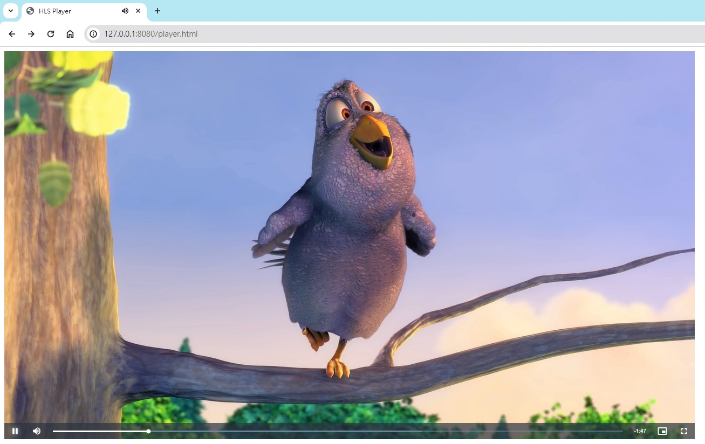

最近在測試 HLS 轉檔
轉出來後有一堆 ts 片段
又懶得上傳到 Staging 環境
於是就想找在本機端可以播放影片的方法

<!-- more -->

首先先認識一下 HLS 是什麼

## 什麼是 HLS

HLS 是一種串流媒體協定
它把一個影片切成許多小片段
使用者只需要下載所需片段就能觀看
不需要等前面都載完
然後播放器會偵測頻寬來選擇不同的畫質

檔案結構大概長這樣
```
hls
├─480p
│  ├─01.ts
│  ├─02.ts
│  ├─03.ts
│  └─playlist.m3u8
├─720p
│  ├─01.ts
│  ├─02.ts
│  ├─03.ts
│  └─playlist.m3u8
├─1080p
│  ├─01.ts
│  ├─02.ts
│  ├─03.ts
│  └─playlist.m3u8
└─index.m3u8
```

第一層有一個 `index.m3u8`，記錄三種畫質的播放路徑
第二層每個畫質資料夾都有一個 `playlist.m3u8`，記錄該畫質的播放路徑
然後還有一些 `.ts` 小片段影片檔

## 如何播放 HLS

我們將透過 Video.js 播放器來實作

### 前置準備
1. 新增一個資料夾叫做 test
2. 在 test 底下新增一個資料夾叫做 video
3. 在 video 底下放入 hls 檔案
3. 在根目錄新增一個 player.html 檔

檔案結構如下
```
test
├─video
│  ├─480p
│  │  ├─01.ts
│  │  ├─...ts
│  │  └─playlist.m3u8
│  ├─720p
│  │  ├─01.ts
│  │  ├─...ts
│  │  └─playlist.m3u8
│  ├─1080p
│  │  ├─01.ts
│  │  ├─...ts
│  │  └─playlist.m3u8
│  └─index.m3u8
└─player.html
```

### 產生 player.html 檔

html 檔內容如下

```
<!DOCTYPE html>
<html lang="en-us">

  <head>
    <meta charset="UTF-8">
	<link rel="shortcut icon" href="#">
    <title>HLS Player</title>
    <link href="https://vjs.zencdn.net/8.10.0/video-js.css" rel="stylesheet">
  </head>
  
<body>
  <video id="my-video" class="video-js" controls preload="auto" width="1280" height="720" data-setup="{}">
    <source src="./video/index.m3u8" type="application/x-mpegURL">
  </video>
  <script src="https://vjs.zencdn.net/8.10.0/video.min.js"></script>
</body>

</html>
```

### 啟動 http-server 服務

1. 安裝 http-server [教學](https://annkuoq.github.io/blog/2019-12-16-install-nodejs-httpserver/)
2. 啟動服務 `http-server . 8080`
3. 瀏覽器前往 `http://127.0.0.1:8080/player.html`
4. 播放影片

<div align="center"></div>

目前播放器是自動偵測頻寬來給不同畫質
不能在播放器上選擇畫質
這個有空再研究


## 參考資料
- [Getting Started with Video.js](https://videojs.com/getting-started/)


