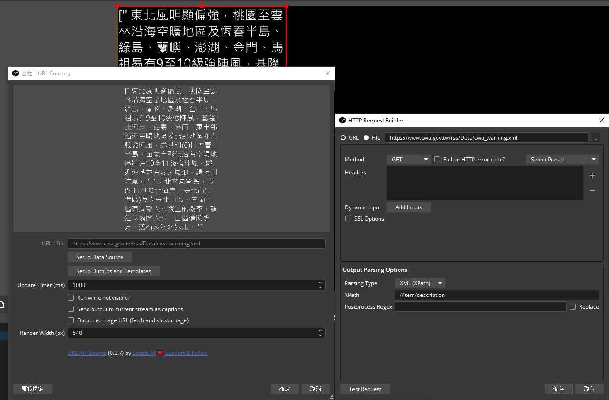
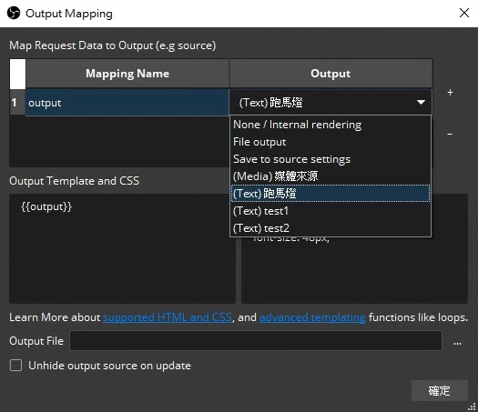
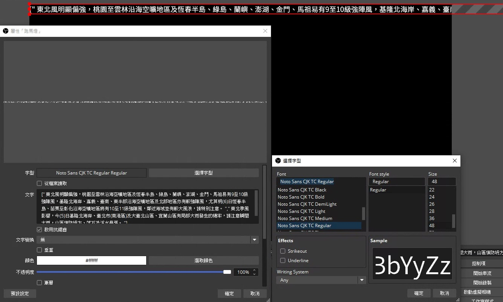
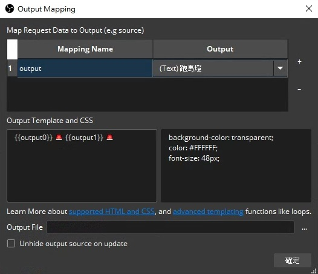
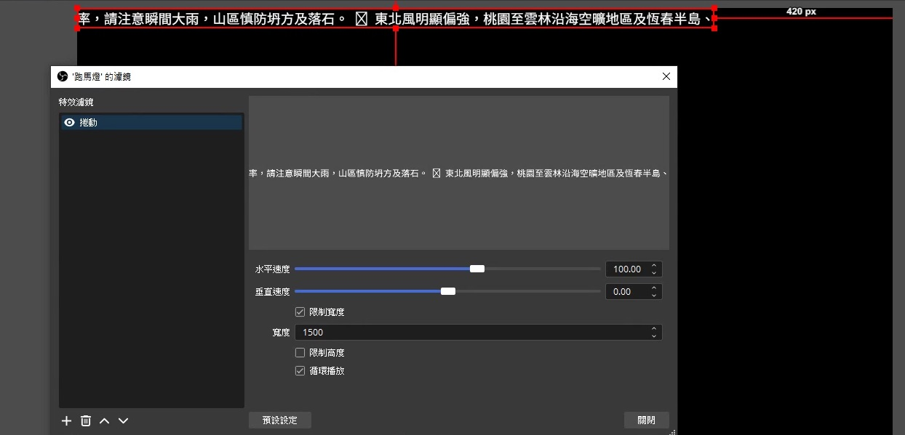

最近常常需要做關於颱風的直播
畫面底部的跑馬燈
都是我 ~工人智慧~ 從氣象署複製貼上的 😆
所以想說有沒有什麼外掛可以自動化

<!-- more -->

上網搜尋後
找到了這個 [URL/API Source](https://obsproject.com/forum/resources/url-api-source-live-data-media-and-ai-on-obs-made-simple.1756/) Plug-in

一打開超多功能
不是工程師的我看的眼花撩亂
所以以下只介紹我有用到的部分

## Windows 安裝

前往 [這裡](https://github.com/locaal-ai/obs-urlsource/releases) 去下載安裝檔
點擊 `obs-urlsource-x.x.x-windows-x64-Installer.exe` 後執行安裝

要注意你的 OBS 版本是否與 Plug-in 版本有互相支援
因為我一開始怎麼安裝都沒有跑出 Plug-in
後來才發現因為我的 OBS 是 29.1.3
必須搭配更老的 Plug-in 版本 0.2.7 才行

不過我最後是把 OBS 升到 30.2.3
並搭配 Plug-in 0.3.7

## 增加來源與提取內容

1. 加入來源 > `URL Source`
2. 點擊 `Setup Data Source`
3. 貼上 RSS URL > https://www.cwa.gov.tw/rss/Data/cwa_warning.xml
4. 解析類型 Parsing Type > `XML (XPath)`
5. 取出你要的內容 XPath > `//item/description` 
6. 點擊 `儲存` > `確定`

解釋一下~
那個 XPath 代表選擇所有 `<item>` 元素中的 `<description>` 內容

<div align="center"></div>

### 原始的 XML 內容

```
<?xml version="1.0" encoding="UTF-8"?>
<rss version="2.0" xmlns:dc="http://purl.org/dc/elements/1.1/">
<channel>
<title><![CDATA[ 中央氣象署警報、特報 ]]></title>
<link>https://www.cwa.gov.tw/</link>
<description><![CDATA[ 中央氣象署 RSS服務 ]]></description>
<language>zh-tw</language>
<copyright><![CDATA[ 使用聲明
1.本署可授權個人以 RSS reader 方式使用本署RSS。
2.個人和非營利網站以及Blog，可以在私人、非商業用途內呈現本署 RSS內的標題資訊，詳細內容必須以連結方式連回本署，呈現資訊時必須標明該來源是「中央氣象署」，且不得更改 RSS內容及解析本 RSS 相關資訊用以製作衍生產品。
3.本署保留適時修改此服務內容及格式的權利。 ]]></copyright>
<lastBuildDate>Tue, 05 Nov 2024 09:00:33 GMT</lastBuildDate>
<ttl>1</ttl>
<image>
<url>https://www.cwa.gov.tw/rss/img/Mark.jpg</url>
<title><![CDATA[ 中央氣象署警報、特報 ]]></title>
<link>https://www.cwa.gov.tw/</link>
</image>
	<item>
		<pubDate>Tue, 05 Nov 2024 07:25:00 GMT</pubDate>
		<title>11/05 15:25 發布陸上強風特報</title>
		<link>https://www.cwa.gov.tw/V8/C/P/Warning/W25.html?T=202411051525</link>
		<guid>https://www.cwa.gov.tw/V8/C/P/Warning/W25.html?T=202411051525</guid>
		<description><![CDATA[ 東北風明顯偏強，桃園至雲林沿海空曠地區及恆春半島、綠島、蘭嶼、澎湖、金門、馬祖易有9至10級強陣風，基隆北海岸、嘉義、臺南、東半部沿海空曠地區及北部地區亦有較強陣風，尤其明(6)日恆春半島、苗栗至彰化沿海空曠地區將有10至11級強陣風，鄰近海域並有較大風浪，請特別注意。 ]]></description>
	</item>
	<item>
		<pubDate>Tue, 05 Nov 2024 08:30:00 GMT</pubDate>
		<title>11/05 16:30 發布大雨特報</title>
		<link>https://www.cwa.gov.tw/V8/C/P/Warning/W26.html?T=202411051630</link>
		<guid>https://www.cwa.gov.tw/V8/C/P/Warning/W26.html?T=202411051630</guid>
		<description><![CDATA[ 東北季風影響，今(5)日基隆北海岸、臺北市(南港區)及大臺北山區、宜蘭山區有局部大雨發生的機率，請注意瞬間大雨，山區慎防坍方、落石及溪水暴漲。 ]]></description>
	</item>
</channel>
</rss>
```

### 提取出來的內容

```
[" 東北風明顯偏強，桃園至雲林沿海空曠地區及恆春半島、綠島、蘭嶼、澎湖、金門、馬祖易有9至10級強陣風，基隆北海岸、嘉義、臺南、東半部沿海空曠地區及北部地區亦有較強陣風，尤其明(6)日恆春半島、苗栗至彰化沿海空曠地區將有10至11級強陣風，鄰近海域並有較大風浪，請特別注意。 "," 東北季風影響，今(5)日基隆北海岸、臺北市(南港區)及大臺北山區、宜蘭山區有局部大雨發生的機率，請注意瞬間大雨，山區慎防坍方、落石及溪水暴漲。 "]
```

## 輸出提取結果

1. 新增文字來源，取名為 `跑馬燈`
2. 雙擊 `URL Source` > `Setup Outputs and Templates`
3. 點擊 Mapping Name 的 `output` > `(Text)跑馬燈`
4. 點擊 `確定`

<div align="center"></div>

提取出的內容就輸出到 `跑馬燈` 了
不過字有點大
這時可以修改一下字型與文字大小

<div align="center"></div>

## 輸出內容整理

仔細看了一下
文字裡面好像出現了奇怪的符號
例如 `[` `]` `"` `,`

原來這個是陣列中有多個值的意思
結構大概是長這樣 `["apple", "banana", "cherry"]` 
意思是說取出了三個值
分別是 蘋果、香蕉、櫻桃

因為氣象署同時發布了兩個警報
所以就跑出了陣列的符號

但沒關係
這個 Plug-in 可以解決這個問題

1. 雙擊 URL Source > `Setup Outputs and Templates`
2.  把 {{output}} 改成 {{output0}} 🚨 {{output1}} 🚨 
3. 點擊 `確定`

解釋一下~
-  {{output0}} 代表第一個警報 (陸上強風特報) 
-  {{output1}} 代表第二個警報 (大雨特報) 
- 中間用 🚨 隔開兩段文字


<div align="center"></div>

## 設定跑馬捲動特效

1. 對 `跑馬燈` 點擊右鍵 > `濾鏡`
2. 新增 `捲動` 特效
3. 將 `限制寬度` 打勾 > 設定跑馬的寬度為 1500
4. 調整 `水平速度` > 設定跑馬的速度為 100
5. 點擊 `關閉`

<div align="center"></div>

大功告成！

如果對這個 Plug-in 有其他問題
也可以到作者的 [Discord](https://discord.gg/AubP6DTT8r) 詢問喔
作者和成員們都蠻熱心回應的！

## 參考資料
- [URL/API Source: Live Data, Media and AI on OBS Made Simple | OBS Forums](https://obsproject.com/forum/resources/url-api-source-live-data-media-and-ai-on-obs-made-simple.1756/)
- [locaal-ai/obs-urlsource | GitHub](https://github.com/locaal-ai/obs-urlsource)
- [XPath Syntax | W3Schools](https://www.w3schools.com/xml/xpath_syntax.asp)


