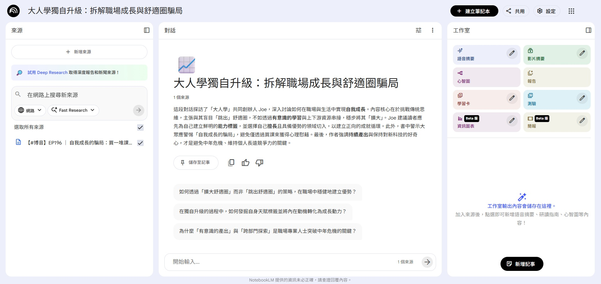
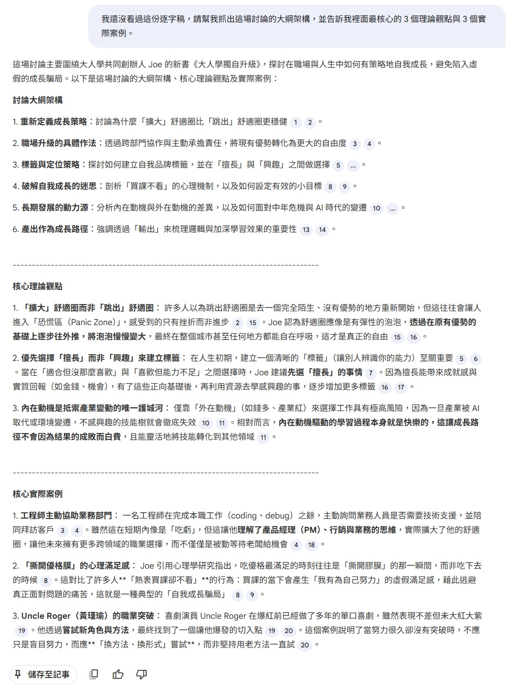
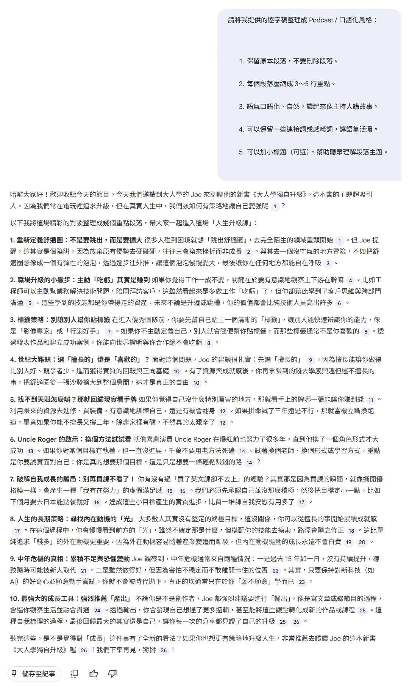
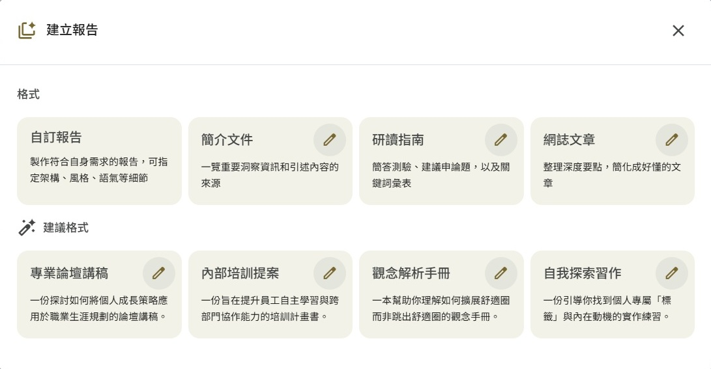
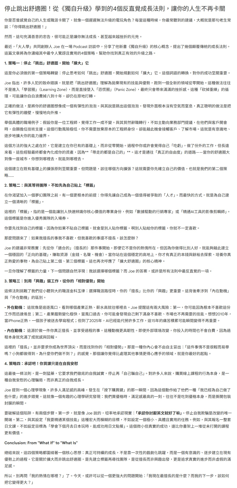

每天都有看不完的影片跟聽不完的 Podcast
如果懶得看，但又想知道重點該怎麼做呢
我們需要三種工具來協助完成
- yt-dlp: 下載字幕
- Python: 整理字幕檔
- NotebookLM: 摘要重點

## 下載 YouTube 字幕

### 安裝 yt-dlp
首先先下載 [yt-dlp](https://github.com/yt-dlp/yt-dlp/releases) 這個工具
請依照自己的作業系統選擇安裝檔
我是 Windows 選擇 `yt-dlp.exe`

### 下載字幕

開一個資料夾
把 `yt-dlp.exe` 放進去
於此資料夾開啟 CMD 並執行以下指令
```
yt-dlp --write-sub --sub-lang "zh.*" --skip-download <影片網址>
```
意思是 `抓上傳者提供的中文字幕`
- `--write-sub`：上傳者提供的字幕檔 (subtitles)
- `--skip-download`：不抓影片
- `--sub-lang`：指定語言
- `zh.*`：繁體中文

你也可以使用以下指令
查看的所有可下載的字幕軌
```
yt-dlp --list-subs <影片網址>
```

## 整理字幕檔內容

### Python 腳本

下載下來的 `.vtt` 檔
因為內容含有 Timecode
不只很佔 token
也很影響敘事上的連續性

```
WEBVTT
Kind: captions
Language: zh-TW

00:01:08.234 --> 00:01:09.269
哈囉各位聽眾大家好

00:01:09.269 --> 00:01:10.603
歡迎收聽最新一集的博音

00:01:10.603 --> 00:01:11.538
你是否有曾經
```

所以我們先用 Python 來整理
請建立一個檔案叫 `vtt_to_txt.py`
```
from pathlib import Path
import re

def vtt_to_txt(vtt_path):
    text_lines = []

    with open(vtt_path, "r", encoding="utf-8") as f:
        for line in f:
            line = line.strip()

            if not line:
                continue

            if line.startswith("WEBVTT") or line.startswith("Kind:") or line.startswith("Language:"):
                continue

            if re.match(r"\d{2}:\d{2}:\d{2}\.\d{3}\s-->\s\d{2}:\d{2}:\d{2}\.\d{3}", line):
                continue

            text_lines.append(line)

    return "\n".join(text_lines)


if __name__ == "__main__":
    for vtt_file in Path(".").glob("*.vtt"):
        output_file = vtt_file.with_suffix(".txt")
        content = vtt_to_txt(vtt_file)
        output_file.write_text(content, encoding="utf-8")
        print(f"轉換完成：{vtt_file.name}")
```

### BAT 檔
為了讓我們可以方便執行 Python 腳本
請建立一個檔案叫 `convert.bat`

```
@echo off
chcp 65001 > nul

echo 開始轉換 VTT 為 TXT...
echo.

python vtt_to_txt.py

echo.
echo 全部處理完成，按任意鍵關閉視窗
pause > nul

```

### 開始轉換
先確認有安裝 [Python](https://www.python.org/downloads/)
1. 把 `.vtt` 丟進資料夾
2. 雙擊 `convert.bat`
3. 同資料夾會出現一堆 `.txt`

```
字幕整理資料夾/
├─ convert.bat        ← 雙擊 bat 檔案
├─ vtt_to_txt.py      ← Python 腳本
├─ ep01.vtt           ← YT 字幕檔
├─ ep02.vtt           ← YT 字幕檔
├─ ep01.txt           ← 整理好的純文字字幕檔
└─ ep02.txt           ← 整理好的純文字字幕檔

```

## 請 AI 整理重點

因為這種逐字稿都超級長
所以選擇使用 [NotebookLM](https://notebooklm.google.com/)
不然其他 AI 可能會一直叫我晚點再來 XD
~畢竟是免費仔~

### 上傳來源

1. 點擊 `＋新建`
2. 把 `.txt` 上傳

你看！光只是上傳字幕檔！
它就馬上摘要一段兩百字的介紹了


> 這段訪談內容圍繞著大人學共同創辦人 Joe 的新書《獨自升級》，深入探討現代人在職涯與個人成長中常見的誤區。Joe 主張與其盲目「跳出舒適圈」去面對無法負荷的挫折，不如透過有意識地擴大舒適圈，在保有現有優勢的基礎上逐步往外探索。他強調建立個人「標籤」的重要性，建議求職者先從自己擅長且具備競爭力的事物切入，以此換取資源後再追求興趣。針對中年危機與產業變遷，訪談指出唯有保持好奇心並持續產出，才能在變動中內化知識並維持不可替代的價值。最後，Joe 鼓勵聽眾將人生視為電玩遊戲，透過主動規劃技能點與任務，在職場中實現真正的選擇自由。


<div align="center"></div>

### 對話面板

你可以在「對話」面板，點擊那些"建議提問"
藉由跟 AI 問答來瞭解內容

> - 如何透過「擴大舒適圈」而非「跳出舒適圈」的策略，在職場中穩健地建立優勢？
> - 在獨自升級的過程中，如何發掘自身天賦標籤並將內在動機轉化為成長動力？
> - 為什麼「有意識的產出」與「跨部門探索」是職場專業人士突破中年危機的關鍵？

如果完全沒看過內容，可以請 AI 先導讀
指令範例一: `我還沒看過這份逐字稿，請幫我抓出這場討論的大綱架構，並告訴我裡面最核心的 3 個理論觀點與 3 個實際案例。`


<div align="center"></div>

如果覺得有點生硬的話，可以請 AI 口語化
指令範例二:
```
請將我提供的逐字稿整理成 Podcast / 口語化風格：
1. 保留原本段落，不要刪除段落。
2. 每個段落壓縮成 3～5 行重點。
3. 語氣口語化、自然，讀起來像主持人講故事。
4. 可以保留一些連接詞或感嘆詞，讓語氣活潑。
5. 可以加小標題（可選），幫助聽眾理解段落主題。
```

<div align="center"></div>

### 工作室面板

你也可以在「工作室」面板生成報告


報告中有很多種類可以選擇
自訂報告、簡介文件、研讀指南、網誌文章
底下還有 AI 給的建議格式

<div align="center"></div>

網誌文章 範例:

<div align="center"></div>

太強拉！
直接幫你寫部落格！

它還可以看產生這個報告的提示詞:
- `Act as a thoughtful writer and synthesizer of ideas, tasked with creating an engaging and readable blog post for a popular online publishing platform known for its clean aesthetic and insightful content. Your goal is to distill the top most surprising, counter-intuitive, or impactful takeaways from the provided source materials into a compelling listicle. The writing style should be clean, accessible, and highly scannable, employing a conversational yet intelligent tone. Craft a compelling, click-worthy headline. Begin the article with a short introduction that hooks the reader by establishing a relatable problem or curiosity, then present each of the takeaway points as a distinct section with a clear, bolded subheading. Within each section, use short paragraphs to explain the concept clearly, and don't just summarize; offer a brief analysis or a reflection on why this point is so interesting or important, and if a powerful quote exists in the sources, feature it in a blockquote for emphasis. Conclude the post with a brief, forward-looking summary that leaves the reader with a final thought-provoking question or a powerful takeaway to ponder.`

請 ChatGPT 翻譯中文: 
- `擔任一位善於思考、整合觀點的寫作者，為一個以簡潔美學與深度內容聞名的主流線上出版平台撰寫一篇引人入勝、易於閱讀的部落格文章。你的任務是：從提供的來源資料中，萃取出最令人驚訝、最違反直覺，或最具影響力的重點洞見，並整理成一篇具吸引力的清單型文章（listicle）。`
- `整體寫作風格應該乾淨、親切、且高度適合快速掃讀，語氣保持對話感但不失思考深度。請撰寫一個吸睛、值得點擊的標題。`
`文章開頭請以一小段引言切入，透過提出讀者能產生共鳴的問題或好奇心來勾住注意力。接著，將每一個重點洞見作為一個獨立段落呈現，並搭配清楚、加粗的小標題。`
- `在每個段落中，使用短段落清楚說明該觀點，且不要只是摘要內容；請加入你對該觀點為何有趣或重要的簡短分析或反思。如果來源資料中有特別有力的引述，請以**區塊引言（blockquote）**的方式呈現，以加強重點。`
- `最後，請用一段簡短、具前瞻性的結語收尾，留給讀者一個值得深思的問題，或一個令人回味的關鍵洞見作為結束。`

其他還有很多功能
之後再慢慢玩吧～