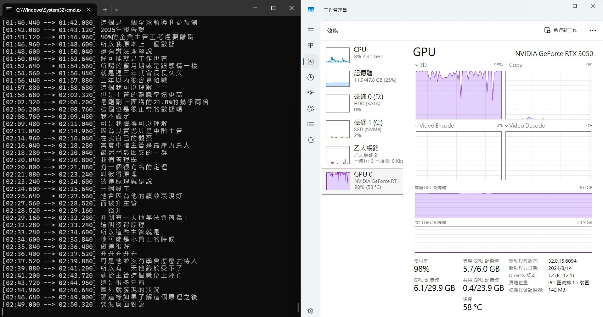

## Whisper 介紹
Whisper 是 OpenAI 開發的自動語音辨識模型
可以把「人講話的聲音」轉成「文字」

對於影片創作者
可以自動產出 SRT/VTT 字幕檔
匯入後製軟體後再修正內容
或是直接匯入 YouTube 後台 (CC 字幕)
不必從頭到尾都自己慢慢打

對於會議紀錄人員
可以把錄音檔轉成逐字稿
再去進行更進階的處理

那我自己的話
就是拿來把影片或 Podcast 轉成逐字稿
再[丟進 AI 快速摘要重點](https://annkuoq.github.io/blog/2026-01-13-how-to-summarize-youtube-videos-with-ai-yt-dlp-python-notebooklm/)

## 本地端與雲端版本
Whisper 分為 `本地端(Local)` 與 `API (雲端)`

| 比較項目 | 本地端 | 雲端 |
| --- | --- | --- |
| 費用 | 完全免費 (需電腦電費) | 付費 (目前 [每分鐘 $0.006 美金](https://platform.openai.com/docs/pricing#other-models)) |
| 硬體要求 | 要有 NVIDIA 顯卡 | 只要能連網，老舊電腦也能跑 |
| 處理速度 | 取決於你的顯示卡 | OpenAI 伺服器會幫你處理好 |
| 隱私性 | 檔案不會離開電腦，適合機密資訊 | 檔案需傳輸到 OpenAI 伺服器 |

如果你有資安與隱私需求
而且有不錯的電腦設備
就可以使用`本地端(Local)`版本

本篇文章主要介紹「本地端」版本

## 目前主流的本地端版本

| 版本名稱 | 特色與優勢 |
| --- | --- |
| [OpenAI Whisper](https://github.com/openai/whisper) (官方原版) | 官方維護，最標準的 Python 庫 |
| [Faster-Whisper](https://github.com/SYSTRAN/faster-whisper) (推薦) | 使用 CTranslate2 引擎重新實作，速度快 4 倍，記憶體用量減少 50% |
| [Whisper.cpp](https://github.com/ggml-org/whisper.cpp) | 用 C/C++ 語言重新編寫，針對 CPU 進行優化 |
| [WhisperX](https://github.com/m-bain/whisperX) | 時間精確度最高 (到單字級別)、可辨識誰說了什麼 (說話人分離) |

## OpenAI Whisper (官方)

我們先嘗試官方版本的 Whisper

### Whisper 安裝
1. 安裝 [Python](https://www.python.org/downloads/)
2. 新增一個專案資料夾叫 `whisper`
3. 在此資料夾位置開啟 CMD 
4. 建立虛擬環境 `python -m venv venv`
5. 啟動虛擬環境 `.\venv\Scripts\activate`
6. 安裝 Whisper `pip install -U openai-whisper`
7. 檢查是否安裝成功 `whisper --help`，如果有出現各種參數訊息就成功了

### ffmpeg 安裝

 1. 到 [gyan.dev](https://www.gyan.dev/ffmpeg/builds/) 下載 `ffmpeg-release-full.7z`
 2. 解壓縮後，把 bin 資料夾中的三個檔案放到專案資料夾中
 ```
 whisper/
├── venv/                # 虛擬環境
├── ffmpeg.exe           # ← 放這裡
├── ffprobe.exe          # ← 放這裡
├── ffplay.exe           # ← 放這裡
└── video.mp4            # 要語音轉文字的影片
 ```

### 模型版本

Whisper 有不同大小的模型
越大精準度越高，但也越吃效能

| 模型名稱 | 檔案大小 | VRAM 用量 | 相對速度 | 準確度 |
| --- | --- | --- | --- | --- |
| Tiny | ~75 MB | ~1 GB | 10x (最快) | 低 |
| Base | ~140 MB | ~1 GB | 7x | 中低 |
| Small | ~460 MB | ~2 GB | 4x | 中 |
| Medium (推薦) | ~1.5 GB | ~5 GB | 2x | 高 |
| Large-v3 | ~3 GB | ~10 GB | 1x (基準) | 最高 |

中文的話推薦使用 Medium 模型
速度跟準確率適中

### 開始使用

1. 將要轉換的影片或音檔放入資料夾中
2. 執行 `whisper video.mp4 --model medium --language zh --device cuda`
- `video.mp4`: 來源檔案，ffmpeg 會提取音訊出來
- `--model medium`: 模型等級
- `--language zh`: 使用中文來辨識
- `--device cuda`: 使用 NVIDIA 顯示卡加速 (若不指定預設用 CPU 跑)

結果發生了錯誤，最後一段寫了
```
RuntimeError: Attempting to deserialize object on a CUDA device but torch.cuda.is_available() is False. 
```
Whisper 想要使用顯卡（CUDA），但 PyTorch 環境偵測不到顯卡
但我電腦確實有 RTX 3050 的顯示卡

3. 移除現有的 PyTorch `pip uninstall torch torchvision torchaudio -y`
4. 安裝 CUDA 版本的 Torch (v12.1) `pip install torch torchvision torchaudio --index-url https://download.pytorch.org/whl/cu121`
5. 檢查是否安裝成功 `python -c "import torch; print(torch.cuda.is_available())"`，如果回傳 True 代表成功
6. 再次執行 `whisper video.mp4 --model medium --language zh --device cuda`

成功啦！
GPU 使用量飛到 100%
CMD 也會顯示目前處理的進度

<div align="center"></div>


使用 3050 顯卡+ medium 模型
測試 52 分 30 秒的檔案
花費了約 24 分鐘
大概就是 2 倍速！

總共產出了五種格式的檔案: `.srt`, `.vtt`, `.txt`, `.json`, `.tsv`


`.srt`: 帶有時間的字幕檔，可匯入後製軟體
```
1
00:00:00,000 --> 00:00:01,080
在職場裡面

2
00:00:01,080 --> 00:00:03,600
我們好像也是把它當成戀愛

3
00:00:03,600 --> 00:00:06,920
好像感覺離職就代表我還沒有找到那個對的人
```

- `.vtt`: 與 SRT 類似，可直接適用於網頁播放器
```
WEBVTT

00:00.000 --> 00:01.080
在職場裡面

00:01.080 --> 00:03.600
我們好像也是把它當成戀愛

00:03.600 --> 00:06.920
好像感覺離職就代表我還沒有找到那個對的人
```

- `.txt`: 純文字逐字稿，適合[丟進 AI 作重點整理](https://annkuoq.github.io/blog/2026-01-13-how-to-summarize-youtube-videos-with-ai-yt-dlp-python-notebooklm/)
```
在職場裡面
我們好像也是把它當成戀愛
好像感覺離職就代表我還沒有找到那個對的人
```
- `.json`: 用於程式開發與深度分析，除了時間軸和文字，它還包含了 Whisper 內部的評分，例如：「信心分數」（AI 覺得自己聽得準不準）和「靜音檢測」等資訊
```
{"text": "\u5728\u8077\u5834\u88e1\u9762\u6211\u5011\u597d\u50cf\u4e5f\u662f\u628a\u5b83\u7576\u6210\u6200\u611b\u597d\u50cf\u611f\u89ba\u96e2\u8077\u5c31\u4ee3\u8868\u6211\u9084\u6c92\u6709\u627e\u5230\u90a3\u500b\u5c0d\u7684\u4eba\u53ef\u662f\............
```

- `.tsv`: 用於 Excel 整理、資料庫匯入，用 Excel 打開會分成 start (開始時間)、end (結束時間)、text (內容) 三欄
```
start	end	text
0	1080	在職場裡面
1080	3600	我們好像也是把它當成戀愛
3600	6920	好像感覺離職就代表我還沒有找到那個對的人
```

如果只想要產出一種檔案，例如 `.srt`
可以使用 `--output_format`
```
whisper video.mp4 --model medium --language zh --device cuda --output_format srt
```

檢查了一下準確度
有些字和專有名詞有打錯
所以需要人工再檢查一次
但比從零開始快多了！

中英數交雜也是可以辨識出來
句子分段跟時間軸也都 OK

## Faster-Whisper (社群)

如果想要更快
可以試試看 Faster-whisper

1. 安裝主程式 `pip install faster-whisper`
2. 安裝指令工具 `pip install whisper-ctranslate2`
3. 開始轉換 `whisper-ctranslate2 video.mp4 --model medium --language zh --device cuda`

在一樣的設備和檔案下
花費了約 6 分鐘
比官方 whisper 快了 4 倍！

## 參考資料
- [openai/whisper: Robust Speech Recognition via Large-Scale Weak Supervision](https://github.com/openai/whisper)
- [SYSTRAN/faster-whisper: Faster Whisper transcription with CTranslate2](https://github.com/SYSTRAN/faster-whisper)
- [【Whisper】免費開源語音辨識自動上字幕　字幕正確率比剪映還高！！！｜下載完後無須聯網　僅需使用自己電腦處理｜如何在Windows上使用Whisper - YouTube](https://www.youtube.com/watch?v=kFtrvdriLU8)