## MuseScore 介紹

MuseScore 是一套免費且開源的製譜軟體
支援 Windows, Mac OS, Linux
可以讓你
- 打 五線譜
- 打 TAB (吉他/烏克麗麗)
- 匯出 PDF

## MuseScore 安裝

1. 到[官網](https://musescore.org/zh-hant)，點擊下載 `MuseScore Studio (不包含 MuseHub)`
2. 執行安裝檔，並一步一步執行安裝

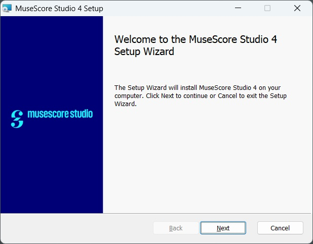

## 開始使用

### 語言設定
1. 上方選單列 `編輯` > `偏好設定`
2. `一般` > 從下拉選單選擇你想要的語言

目前 繁體中文 有些翻譯的沒那麼完整
所以就看各人選擇~

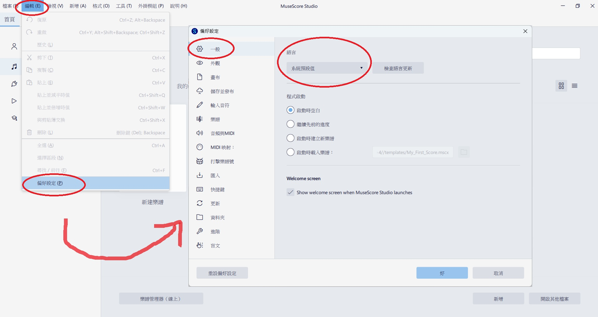

### 建立樂譜
1. 上方選單列 `檔案` > `新建`
2. 點 `撥弦樂器`，在這烏克麗麗有兩種可選，就依需求來選擇
- `尤克里里 (指法譜)`: 四線譜 TAB (~翻譯很怪我知道XD~)
- `烏克麗麗`: 五線譜
3. 我以 TAB 譜為例，因此雙擊 `尤克里里 (指法譜)` 後，按 `完成`

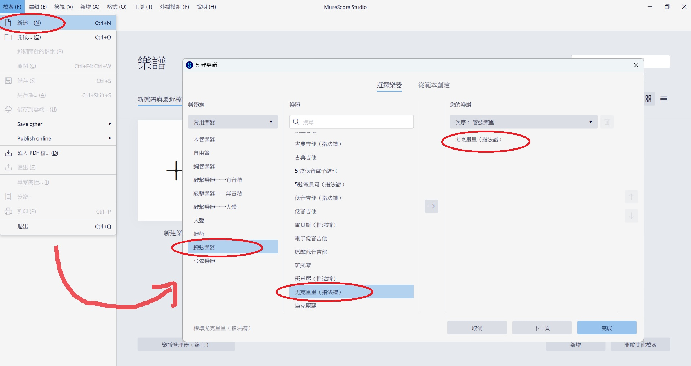

成功建立一個 TAB 四線譜~

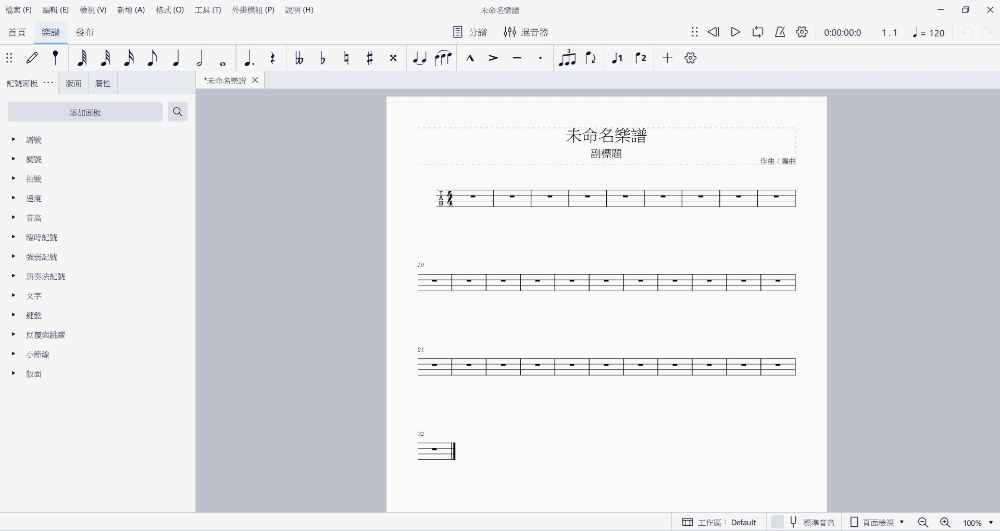

### 儲存樂譜
1. 上方選單列 `檔案` > `儲存`
2. 點擊 `儲存到本機` (`.mscz` 格式)

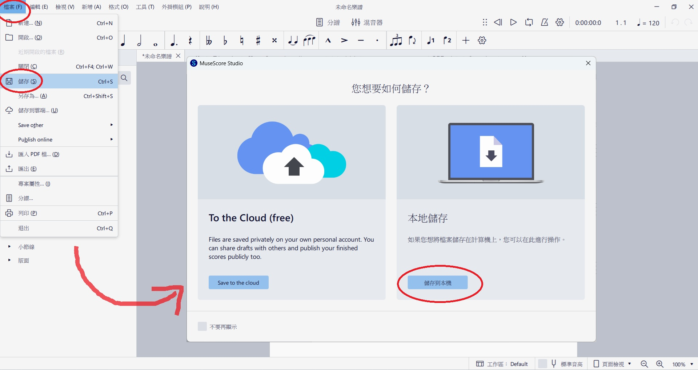

若想設定自動儲存
可以到上方選單列 > `編輯` > `偏好設定` > `儲存並發布`
然後就能調整 `自動儲存間隔時間`

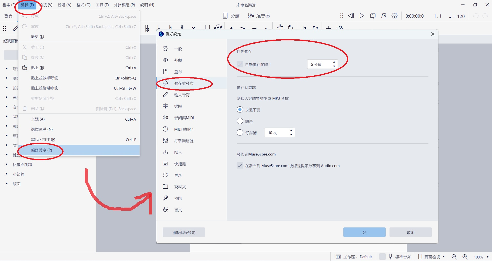

### 輸入四線譜

#### 基本操作
1. 滑鼠點擊要編輯的小節
2. 鍵盤點擊 `N` (變藍底) 進到輸入模式
3. 透過 `上下左右` 移動到要輸入的位置
4. 按住 `Shift+數字1~7` 選擇音符長度 (四分音符、八分音符...)
5. 點擊 `數字`，表示按第幾格
點擊 `;` 則輸入休止符
6. 點擊 `ESC` 退出輸入模式

#### 進階操作
點擊譜上的數字 (變藍色)，點擊 `N`
- 點擊 `上下鍵` 可修改要按的格數
- 點擊 `Shift+數字1~7` 可調整音符長度
- 點擊 `Shift+左/右` 可調整音符的前後順序
- 點擊 `Ctrl+上/下` 可在不同弦選擇相同的音

### 五線譜與 TAB 譜連動 
如果想要輸入五線譜，自動顯示 TAB 指法
或輸入 TAB 指法，自動顯示五線譜的話

1. 到左側 `版面` 視窗
2. 展開 `烏克麗麗`
3. 點擊 `四線指法譜` 右邊齒輪 > 創建關聯譜表
4. 點擊 `[關聯]四線指法譜` 右邊齒輪 > 譜表類型: `標準`
5. 如果想要把五線譜擺上面，可以點擊 `[關聯]高音譜號`後，按 `↑` 調整位置

> 如果沒看到`版面`，可以從 `上方選單列 > 檢視 > 版面` 來開啟

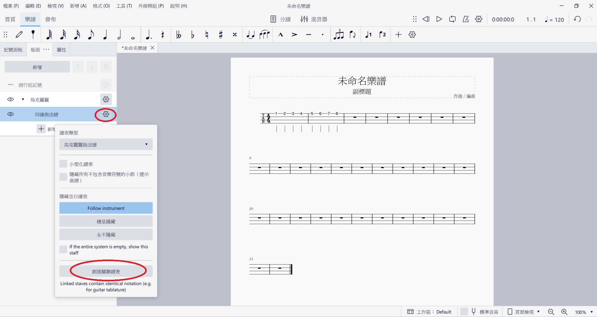

成功顯示相對應的樂譜~

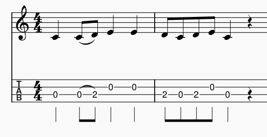

### 輸入五線譜

#### 基本操作
1. 滑鼠點擊要編輯的小節
2. 點擊 `N` (變藍底) 進到輸入模式
3. 透過 `左右` 移動到要輸入的位置
4. 點擊 `數字1~7` 選擇音符長度 (四分音符、八分音符...)
5. 點擊 `CDEFGAB` 來輸入音高 (Do, Re, Mi...)
點擊 `0` 則輸入休止符
6. 點擊 `ESC` 退出輸入模式

#### 進階操作
點擊譜上的音符 (變藍色)，點擊 `N`
- 點擊 `上下鍵` 可修改音高
- 點擊 `數字1~7` 可調整音符長度
- 點擊 `Shift+左/右` 可調整音符的前後順序
- 點擊 `Ctrl+上/下` 可高八度或低八度

### 其他

#### 刪除小節
1. 按住 `Shift` 點選要刪除的小節們 (變藍色)
2. 點擊右鍵 > `刪除小節`

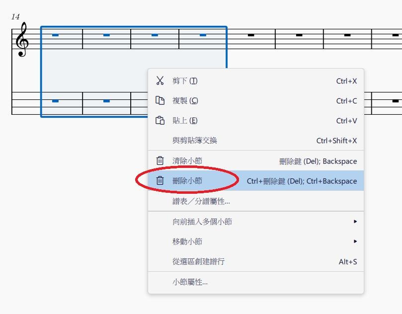

#### 小節換行
如果想讓樂譜一排只顯示四個小節的話
先點擊第四個小節，按 `Enter` 就會換行了~

#### 輸入歌詞
1. 點擊譜上的數字 (變藍色)
2. 點擊 `Ctrl+L`
3. 輸入歌詞，按 `右` 繼續輸入歌詞
4. 按 `ESC` 離開編輯模式

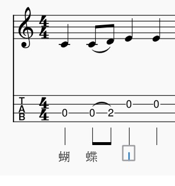

### 播放樂譜
右上方有一排控制播放的區域
由左到右是: 
- `倒帶`: 從樂譜(或循環片段)開頭開始播放
- `播放`：開始和停止播放
- `循環播放`：框選範圍後，點擊可設定循環播放區域；若不框選範圍，則全曲循環播放
- `節拍器`：開啟或關閉節拍器
- `播放設定`：其他播放控制相關功能
- `播放計數器`：顯示播放時間、小節與拍子
- `播放速度`：可手動調整播放速度

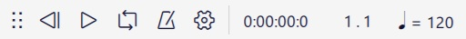

若想要改變整個樂譜的 BPM (每分鐘拍數)
1. 先點擊第一個小節
2. 上方選單列 `新增` > `文字` > `速度記號`
3. 雙擊數字就可以改變 BPM

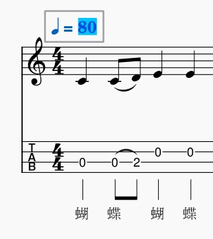

### 匯出樂譜
1. 上方選單列 `檔案` > `匯出`
2. 有很多種格式可以選擇
   - PDF
   - PNG
   - SVG
   - MP3
   - WAV
   - ...
3. 點擊 `匯出...`

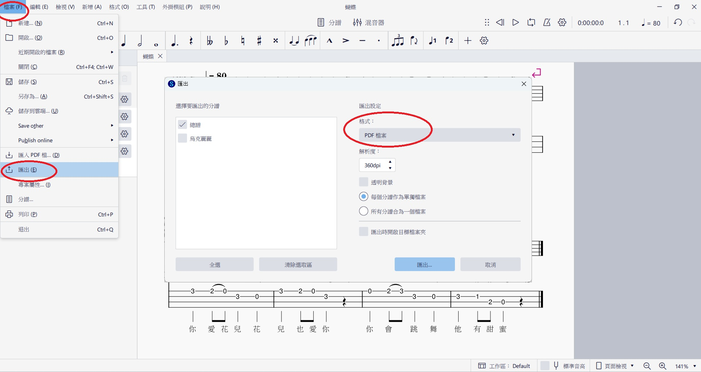

## 樂譜成品

《蝴蝶》樂譜完成~

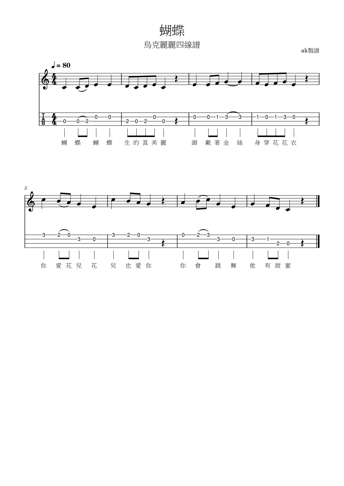

## ~踩坑心得~

1. 打完音符之後，發現音符長度不對，如何修改?
a. 滑鼠點擊打錯的音 (讓它變藍色)
b. 點上方工具列的`音符長度` (四分音符、八分音符...)，MuseScore 會自動補休止符

2. 改了音符長度以後，發現後面多了休止符，要怎麼把後面的音往前補位?
a. 滑鼠點擊想移動的第一個音
b. 按住 Shift 點想移動的最後一個音
c. `Ctrl+X` 剪下
d. 點選要取代的第一個音或休止符
e. `Crtl+V` 貼上

3. 如何在音符中間插入休止符?
a. 點想移動的第一個音
b. 按住 `Shift` 點想移動的最後一個音
c. 滑鼠按住小節空白處 (非音符) `往後拖曳`，MuseScore 會自動補休止符

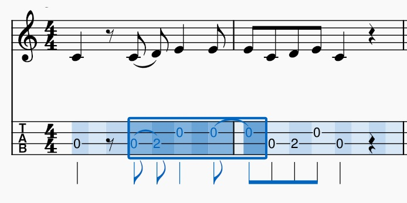

4. 亂改之後，發現某幾個小節拍數亂掉，也無法插入音符或休止符?
a. 點一下那個小節 (整個小節變藍)
b. 按 `右鍵` > `小節屬性`
c. 去手動修改 `實際上的` 拍數欄位 (例如 4/4)
c. 按 `確定` 之後，MuseScore 會自動補滿剩下的拍子

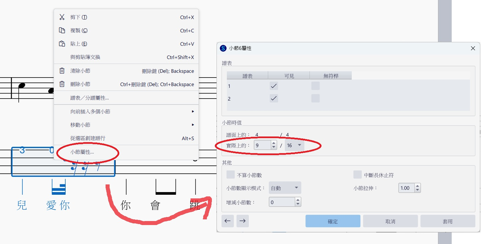

5. 小節 (視覺) 寬度有的長有的短，怎麼調整成一樣的寬度?
a. 點擊小節
b. 點擊 `shift+{` 縮短
c. 點擊 `shift+}` 加長

6. 匯出 PDF 後，用 Chrome 分頁開啟，標題顯示 `未命名樂譜`，但檔案名稱卻是正常的?
a. 上方選單列 `檔案` > `專案屬性`
b. 編輯 `作品標題`

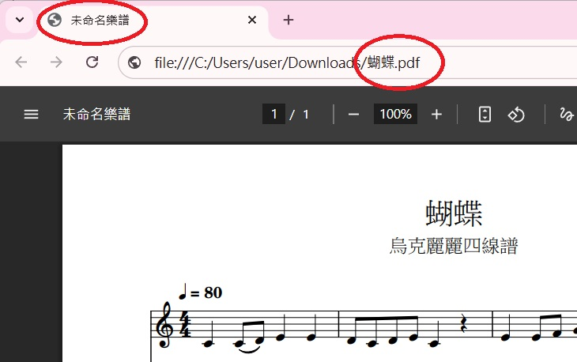

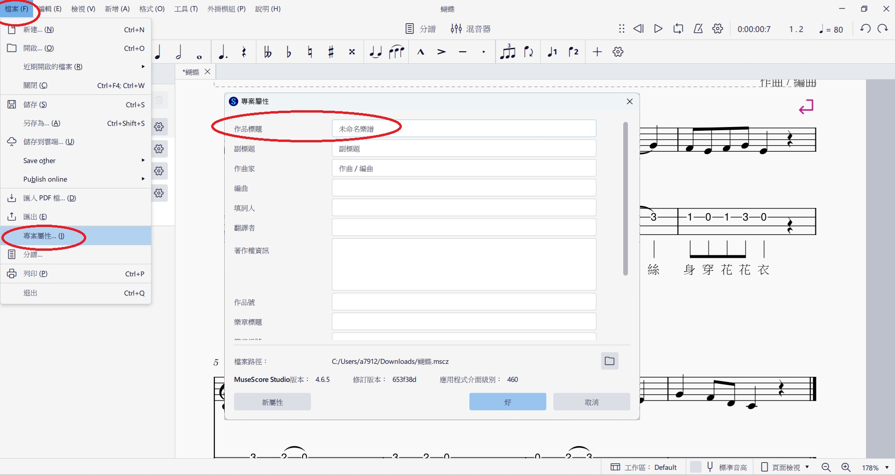

## 參考資料
- [MuseScore Studio Handbook 官方手冊](https://handbook.musescore.org/)
- [一篇文章內，快速學會使用 MuseScore 創作樂譜！](https://nicechord.com/post/musescore-basics/)
- [MuseSore 免費軟體教學 烏克麗麗四線譜 吉他六線譜怎麼打 什麼是弱起拍](https://www.youtube.com/watch?v=9EixfHMkt5Q)