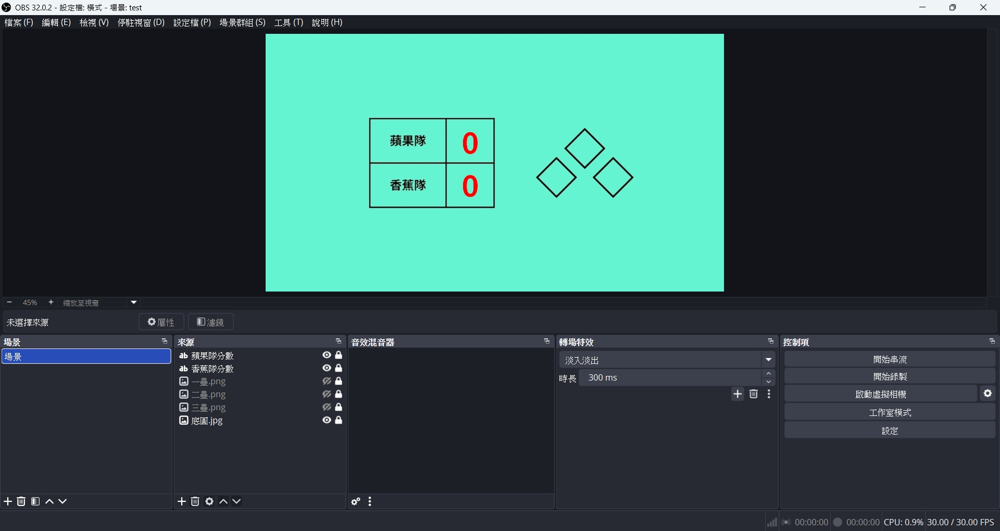
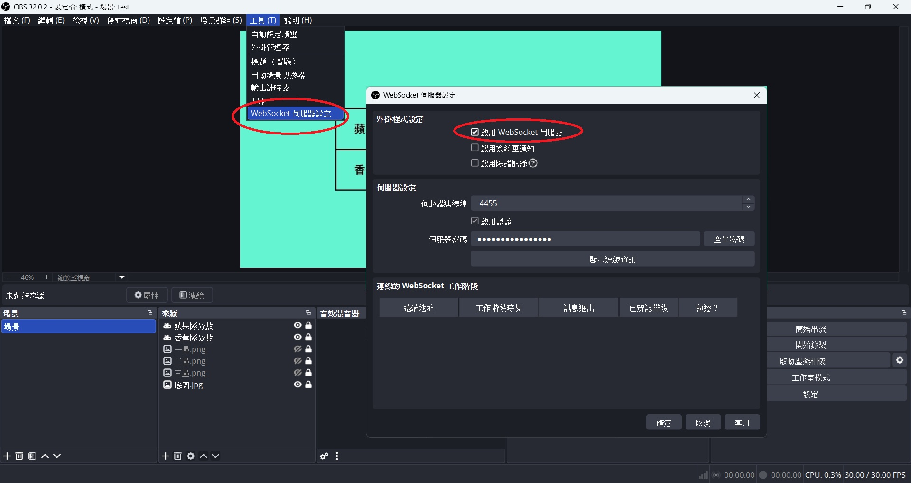
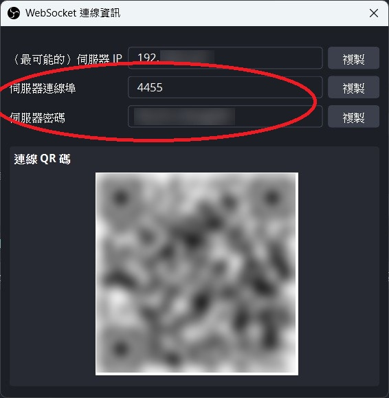
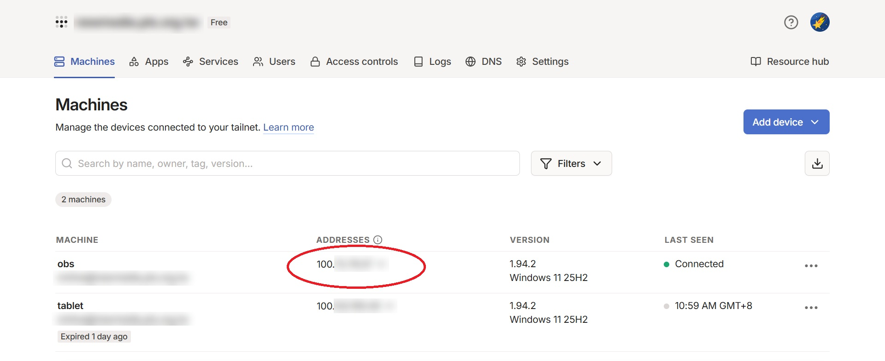
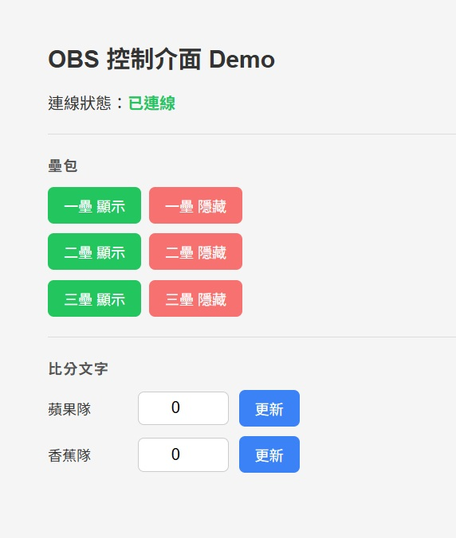
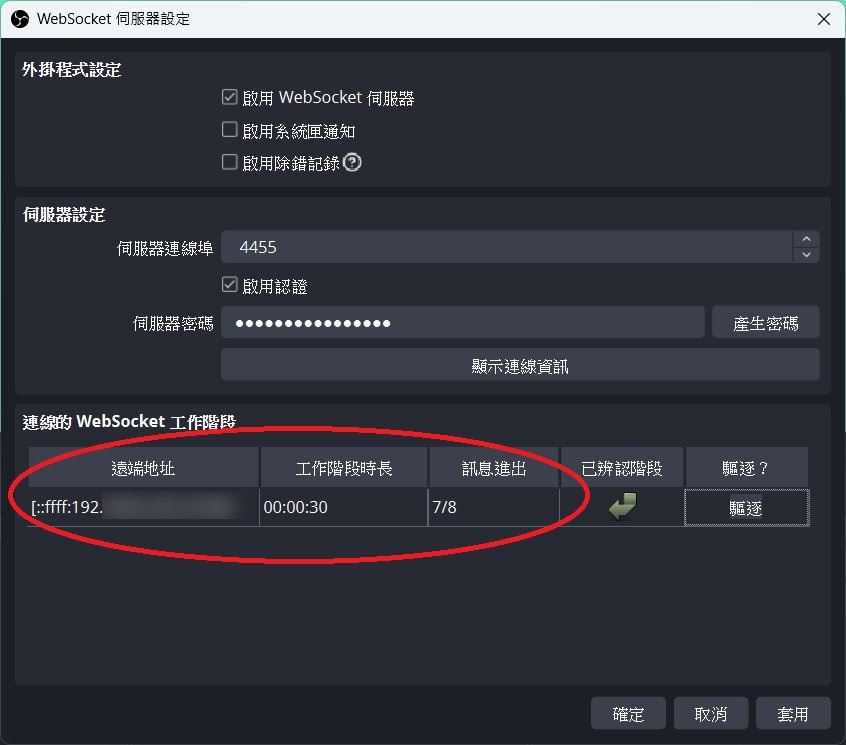
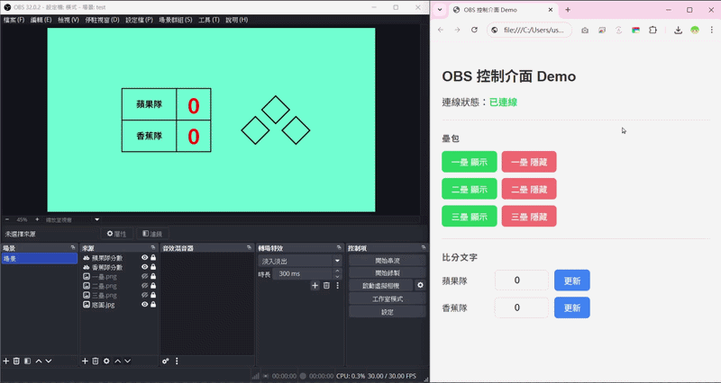
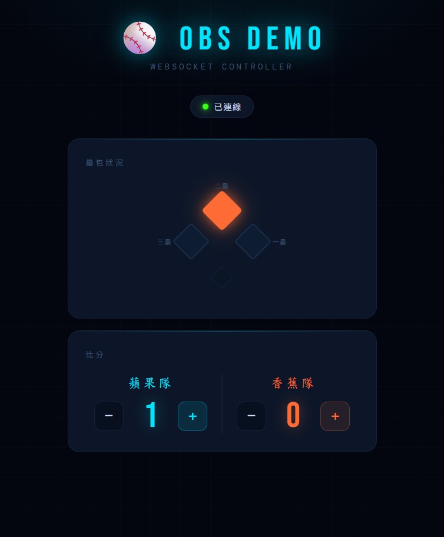
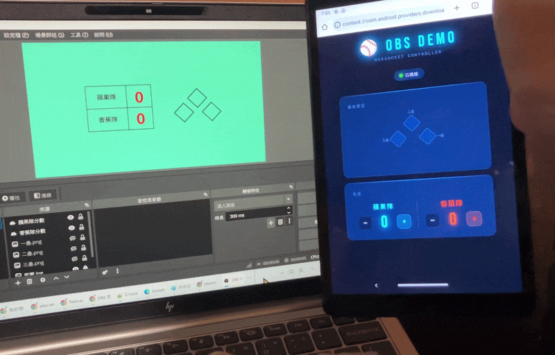

如果你想做一場運動賽事的比分轉播，
人就在球場邊，但直播電腦卻放在家裡，該怎麼辦？

使用 RustDesk 或 Chrome Remote 雖然可行
但畫面容易延遲，而且會占用大量網路頻寬

其實只要準備這三樣工具
就能輕鬆解決問題

- OBS (已內建 WebSocket 伺服器)
- Tailscale (跨網段安全連線)
- 瀏覽器 (Chrome/Safari/Edge 皆可)

## WebSocket 介紹

WebSocket 是一種網路通訊協定
可以讓瀏覽器與伺服器之間建立一條「持續開啟」的雙向通道

一般網頁的運作方式是「你問一次，伺服器答一次」
每次發送請求都需要重新建立連線，屬於短連線模式

而 WebSocket 在連線建立後會一直保持開啟
雙方都可以隨時主動傳送資料，不需要等待對方先發出請求
因此特別適合即時更新的應用場景

OBS 剛好內建 WebSocket 伺服器
讓外部程式或網頁可以透過這個通道傳送指令來控制它
例如切換場景、更新文字、修改比分等等

不過預設情況下，它通常只能在內網中連線
例如電腦和手機都連在同一個 Wi-Fi 下

所以如果人不在家裡，就需要再加上一個工具
那就是 Tailscale

## Tailscale 介紹

Tailscale 是一個基於 WireGuard 的 VPN 服務
可以讓不同網路環境下的裝置
像是在同一個區域網路中一樣彼此連線

傳統 VPN 通常需要自行架設伺服器
並為每一台設備手動設定網路參數
技術門檻相對較高

而使用 Tailscale 就簡單得多
只要在各個設備上安裝並登入同一個帳號
它就會自動建立安全連線，幾乎不需要額外設定

由於它支援 Windows、macOS、Linux、Android、iOS
因此也可以安裝在手機或平板上

在 [免費方案](https://tailscale.com/pricing?plan=personal) 下，目前最多可連接 100 台設備
對個人使用或小型團隊來說已經相當足夠


## 開始動手

### OBS 場景設定

先簡單做幾張圖放進 OBS 中
- 一張底圖: 含有兩隊名稱、分數格、空壘包
- 三張塗滿壘包的圖: 一壘、二壘、三壘 (先關閉眼睛)

再加上兩個文字來源
分別代表兩隊的分數 (先輸入 0 分)
- 蘋果隊分數
- 香蕉隊分數

<div align="center"></div>

### OBS WebSocket 設定
1. 點擊上方選單 `工具` > `WebSocket 伺服器設定`
2. 勾選 `啟用 WebSocket 伺服器`
3. 勾選 `啟用驗證` 並設定密碼

請記下 伺服器連接埠 (預設 `4455`) 與 伺服器密碼 (點擊`顯示連線資訊`可查看)

<div align="center"></div>

<div align="center"></div>

### Tailscale 設定
1. 在 OBS 電腦和遠端設備安裝 [Tailscale](https://tailscale.com/)
2. 兩台設備都使用同一個帳號登入
3. 檢查 Tailscale [後台](https://login.tailscale.com/admin/machines) 是否有顯示兩台設備上線 (顯示綠點 Connected)

請記下 OBS 電腦的 Tailscale IP

<div align="center"></div>

### 製作控制介面

你可以選擇自己寫程式
或者選擇市面上的現成工具
例如
- [Touch Portal](https://www.touch-portal.com/)
- [OBS Blade](https://apps.apple.com/us/app/obs-blade/id1523915884)
- [Stream Deck Mobile](https://play.google.com/store/apps/details?id=com.corsair.android.streamdeck)
- [OBS Controller](https://play.google.com/store/apps/details?id=se.erikfahlen.obscontroller)
...

如果自己寫程式的話
需要有 HTML, CSS, JavaScript 的基礎
不過我現在都叫 AI 寫 (X

#### 第一版控制介面 (陽春)

以下是 AI 產生的程式碼
儲存到記事本後
副檔名改成 `.html` 即可

```
<!DOCTYPE html>
<html lang="zh-TW">
<head>
<meta charset="UTF-8">
<meta name="viewport" content="width=device-width, initial-scale=1.0">
<title>OBS 控制介面 Demo</title>
<style>
  body {
    font-family: sans-serif;
    max-width: 480px;
    margin: 40px auto;
    padding: 0 20px;
    background: #f5f5f5;
    color: #333;
  }

  h2 { margin-bottom: 4px; }

  #status { font-weight: bold; color: #888; }
  #status.connected { color: #22c55e; }
  #status.error { color: #ef4444; }

  hr { border: none; border-top: 1px solid #ddd; margin: 20px 0; }

  h3 {
    margin-bottom: 12px;
    font-size: 0.9rem;
    color: #555;
    text-transform: uppercase;
    letter-spacing: 1px;
  }

  .btn-row { display: flex; gap: 8px; margin-bottom: 10px; }

  button {
    padding: 8px 16px;
    border: none;
    border-radius: 6px;
    cursor: pointer;
    font-size: 0.9rem;
    background: #e2e8f0;
    color: #333;
    transition: background 0.15s;
  }
  button:hover { background: #cbd5e1; }
  button.on  { background: #22c55e; color: #fff; }
  button.on:hover  { background: #16a34a; }
  button.off { background: #f87171; color: #fff; }
  button.off:hover { background: #dc2626; }
  button.send { background: #3b82f6; color: #fff; }
  button.send:hover { background: #2563eb; }

  .score-row {
    display: flex;
    align-items: center;
    gap: 10px;
    margin-bottom: 10px;
  }
  .score-row label { width: 80px; font-size: 0.9rem; }

  input[type="number"] {
    width: 70px;
    padding: 7px 10px;
    border: 1px solid #ccc;
    border-radius: 6px;
    font-size: 1rem;
    text-align: center;
  }
</style>
</head>
<body>

<h2>OBS 控制介面 Demo</h2>

<p>連線狀態：<span id="status">連線中...</span></p>

<hr>

<h3>壘包</h3>
<div class="btn-row">
  <button class="on" onclick="setVisible('一壘.png', true)">一壘 顯示</button>
  <button class="off" onclick="setVisible('一壘.png', false)">一壘 隱藏</button>
</div>
<div class="btn-row">
  <button class="on" onclick="setVisible('二壘.png', true)">二壘 顯示</button>
  <button class="off" onclick="setVisible('二壘.png', false)">二壘 隱藏</button>
</div>
<div class="btn-row">
  <button class="on" onclick="setVisible('三壘.png', true)">三壘 顯示</button>
  <button class="off" onclick="setVisible('三壘.png', false)">三壘 隱藏</button>
</div>

<hr>

<h3>比分文字</h3>
<div class="score-row">
  <label>蘋果隊</label>
  <input type="number" id="apple-score" value="0" min="0">
  <button class="send" onclick="sendScore('apple')">更新</button>
</div>
<div class="score-row">
  <label>香蕉隊</label>
  <input type="number" id="banana-score" value="0" min="0">
  <button class="send" onclick="sendScore('banana')">更新</button>
</div>

<script>
const OBS_HOST = '你的 Tailscale IP';
const OBS_PORT = 4455;
const OBS_PASS = '你的 WebSocket 密碼';

let ws, authenticated = false, msgId = 1;
const pending = {};

// 計算 SHA-256
async function sha256(msg) {
  const buf = await crypto.subtle.digest('SHA-256', new TextEncoder().encode(msg));
  return btoa(String.fromCharCode(...new Uint8Array(buf)));
}

// 連線
function connect() {
  ws = new WebSocket(`ws://${OBS_HOST}:${OBS_PORT}`);

  ws.onopen = () => {
    document.getElementById('status').textContent = '已連上，驗證中...';
  };

  ws.onclose = () => {
    authenticated = false;
    const el = document.getElementById('status');
    el.textContent = '連線中斷，重試中...';
    el.className = 'error';
    setTimeout(connect, 5000);
  };

  ws.onmessage = async (e) => {
    const msg = JSON.parse(e.data);

    // op 0 = Hello，開始驗證
    if (msg.op === 0) {
      const { challenge, salt } = msg.d.authentication;
      const secret = await sha256(OBS_PASS + salt);
      const auth = await sha256(secret + challenge);
      send(1, { rpcVersion: 1, authentication: auth });
    }

    // op 2 = 驗證成功
    else if (msg.op === 2) {
      authenticated = true;
      const el = document.getElementById('status');
      el.textContent = '已連線';
      el.className = 'connected';
    }

    // op 7 = 指令回應
    else if (msg.op === 7) {
      const cb = pending[msg.d.requestId];
      if (cb) { cb(msg.d); delete pending[msg.d.requestId]; }
    }
  };
}

// 發送 WebSocket 訊息
function send(op, data) {
  if (ws && ws.readyState === WebSocket.OPEN)
    ws.send(JSON.stringify({ op, d: data }));
}

// 發送 OBS 指令
function request(type, data = {}) {
  return new Promise(resolve => {
    const id = String(msgId++);
    pending[id] = resolve;
    send(6, { requestType: type, requestId: id, requestData: data });
  });
}

// 顯示或隱藏圖層
async function setVisible(sourceName, visible) {
  // 先取得所有場景
  const scenes = await request('GetSceneList');
  for (const scene of scenes.responseData.scenes) {
    // 取得場景內的圖層清單
    const items = await request('GetSceneItemList', { sceneName: scene.sceneName });
    for (const item of items.responseData.sceneItems) {
      if (item.sourceName === sourceName) {
        // 找到後設定顯示或隱藏
        await request('SetSceneItemEnabled', {
          sceneName: scene.sceneName,
          sceneItemId: item.sceneItemId,
          sceneItemEnabled: visible,
        });
        return;
      }
    }
  }
}

// 更新文字來源
async function setTextValue(inputName, value) {
  await request('SetInputSettings', {
    inputName: inputName,
    inputSettings: { text: String(value) },
  });
}

// 送出比分
function sendScore(team) {
  const value = document.getElementById(`${team}-score`).value;
  const sourceName = team === 'apple' ? '蘋果隊分數' : '香蕉隊分數';
  setTextValue(sourceName, value);
}

connect();
</script>
</body>
</html>
```

其中 108~110 行
記得換成你自己的設定
`const OBS_HOST = 'OBS 電腦的 Tailscale IP';`
`const OBS_PORT = 4455;`
`const OBS_PASS = 'OBS WebSocket 密碼';`

用瀏覽器打開後長這樣
頁面上會顯示連線狀態 (已連線)

<div align="center"></div>

也可以到 OBS 看連線狀態

<div align="center"></div>

連線成功後就可以遠端操控 OBS 囉
<div align="center"></div>


#### 第二版控制介面 (華麗)

如果覺得這個介面很陽春
可以請 AI 改！

例如把壘包視覺化
然後使用加減按鈕來設定分數
畢竟人在外面還要手動輸入數字很麻煩啊

以下為 AI 修改的程式碼
(行數直接變兩倍XD)

```
<!DOCTYPE html>
<html lang="zh-TW">
<head>
<meta charset="UTF-8">
<meta name="viewport" content="width=device-width, initial-scale=1.0">
<title>OBS 控制介面 Demo</title>
<link href="https://fonts.googleapis.com/css2?family=Bebas+Neue&family=DM+Mono:wght@400;500&family=Noto+Sans+TC:wght@400;700&display=swap" rel="stylesheet">
<style>
  :root {
    --bg: #03060f;
    --surface: #080f1e;
    --card: #0c1628;
    --border: #162038;
    --accent: #00e5ff;
    --accent2: #ff6b35;
    --green: #39ff14;
    --text: #cdd9f0;
    --muted: #3d5475;
    --base-off: #0e1c32;
    --base-on: #ff6b35;
  }

  * { box-sizing: border-box; margin: 0; padding: 0; }

  body {
    background: var(--bg);
    color: var(--text);
    font-family: 'Noto Sans TC', sans-serif;
    min-height: 100vh;
    display: flex;
    flex-direction: column;
    align-items: center;
    padding: 32px 16px 48px;
    background-image:
      radial-gradient(ellipse 80% 40% at 50% -10%, rgba(0,229,255,0.07) 0%, transparent 70%),
      repeating-linear-gradient(0deg, transparent, transparent 40px, rgba(255,255,255,0.012) 40px, rgba(255,255,255,0.012) 41px),
      repeating-linear-gradient(90deg, transparent, transparent 40px, rgba(255,255,255,0.012) 40px, rgba(255,255,255,0.012) 41px);
  }

  .header { text-align: center; margin-bottom: 32px; }

  .title {
    font-family: 'Bebas Neue', cursive;
    font-size: 2.8rem;
    letter-spacing: 8px;
    color: var(--accent);
    text-shadow: 0 0 30px rgba(0,229,255,0.5), 0 0 60px rgba(0,229,255,0.2);
    line-height: 1;
  }

  .subtitle {
    font-family: 'DM Mono', monospace;
    font-size: 0.7rem;
    letter-spacing: 3px;
    color: var(--muted);
    margin-top: 6px;
    text-transform: uppercase;
  }

  .status-bar {
    display: flex;
    align-items: center;
    gap: 8px;
    background: var(--card);
    border: 1px solid var(--border);
    border-radius: 20px;
    padding: 6px 16px;
    margin-bottom: 28px;
    font-family: 'DM Mono', monospace;
    font-size: 0.72rem;
    letter-spacing: 1px;
  }

  .dot {
    width: 8px; height: 8px;
    border-radius: 50%;
    background: var(--muted);
    transition: all 0.4s;
  }
  .dot.connected {
    background: var(--green);
    box-shadow: 0 0 8px var(--green), 0 0 16px rgba(57,255,20,0.3);
    animation: pulse 2s infinite;
  }
  .dot.error { background: #ff4444; box-shadow: 0 0 8px #ff4444; }

  @keyframes pulse {
    0%, 100% { opacity: 1; }
    50% { opacity: 0.5; }
  }

  .card {
    background: var(--card);
    border: 1px solid var(--border);
    border-radius: 16px;
    padding: 24px;
    width: 100%;
    max-width: 420px;
    margin-bottom: 16px;
    position: relative;
    overflow: hidden;
  }

  .card::before {
    content: '';
    position: absolute;
    top: 0; left: 0; right: 0;
    height: 1px;
    background: linear-gradient(90deg, transparent, var(--accent), transparent);
    opacity: 0.4;
  }

  .card-label {
    font-family: 'DM Mono', monospace;
    font-size: 0.65rem;
    letter-spacing: 3px;
    color: var(--muted);
    text-transform: uppercase;
    margin-bottom: 20px;
  }

  /* ── 壘包 ── */
  .diamond-area {
    display: flex;
    justify-content: center;
    align-items: center;
    height: 160px;
  }

  .diamond {
    position: relative;
    width: 120px;
    height: 120px;
  }

  .base {
    position: absolute;
    width: 36px; height: 36px;
    background: var(--base-off);
    border: 2px solid #1a2d4a;
    border-radius: 4px;
    cursor: pointer;
    transition: all 0.2s cubic-bezier(0.34, 1.56, 0.64, 1);
  }

  .base.active {
    background: var(--base-on);
    border-color: var(--base-on);
    box-shadow: 0 0 16px rgba(255,107,53,0.7), 0 0 32px rgba(255,107,53,0.3);
  }

  .base-label {
    position: absolute;
    font-family: 'DM Mono', monospace;
    font-size: 0.55rem;
    color: var(--muted);
    letter-spacing: 1px;
    pointer-events: none;
  }

  .base-1 { right: 0; top: 50%; transform: translateY(-50%) rotate(45deg); }
  .base-2 { top: 0; left: 50%; transform: translateX(-50%) rotate(45deg); }
  .base-3 { left: 0; top: 50%; transform: translateY(-50%) rotate(45deg); }

  .base-1.active { transform: translateY(-50%) rotate(45deg) scale(1.1); }
  .base-2.active { transform: translateX(-50%) rotate(45deg) scale(1.1); }
  .base-3.active { transform: translateY(-50%) rotate(45deg) scale(1.1); }

  .label-1 { right: -28px; top: 50%; transform: translateY(-50%); }
  .label-2 { top: -22px; left: 50%; transform: translateX(-50%); }
  .label-3 { left: -28px; top: 50%; transform: translateY(-50%); }

  .base-home {
    position: absolute;
    bottom: 0; left: 50%;
    transform: translateX(-50%) rotate(45deg);
    width: 22px; height: 22px;
    background: #0a1525;
    border: 1px solid var(--border);
    border-radius: 3px;
  }

  /* ── 比分 ── */
  .scores-row {
    display: grid;
    grid-template-columns: 1fr auto 1fr;
    align-items: center;
    gap: 0;
  }

  .score-block { text-align: center; }

  .score-team {
    font-family: 'Bebas Neue', cursive;
    font-size: 1.1rem;
    letter-spacing: 3px;
    margin-bottom: 10px;
    color: var(--accent);
  }

  .score-block:last-child .score-team { color: var(--accent2); }

  .score-controls {
    display: flex;
    align-items: center;
    justify-content: center;
    gap: 10px;
  }

  .score-btn {
    width: 40px; height: 40px;
    border-radius: 10px;
    border: 1px solid var(--border);
    background: var(--surface);
    color: var(--text);
    font-size: 1.4rem;
    cursor: pointer;
    transition: all 0.15s;
    display: flex; align-items: center; justify-content: center;
    font-family: 'DM Mono', monospace;
    line-height: 1;
  }

  .score-btn:hover { background: var(--border); }
  .score-btn:active { transform: scale(0.95); }

  .score-btn.plus {
    background: rgba(0,229,255,0.1);
    border-color: rgba(0,229,255,0.3);
    color: var(--accent);
  }
  .score-btn.plus:hover {
    background: rgba(0,229,255,0.2);
    box-shadow: 0 0 16px rgba(0,229,255,0.2);
  }

  .score-block:last-child .score-btn.plus {
    background: rgba(255,107,53,0.1);
    border-color: rgba(255,107,53,0.3);
    color: var(--accent2);
  }
  .score-block:last-child .score-btn.plus:hover {
    background: rgba(255,107,53,0.2);
    box-shadow: 0 0 16px rgba(255,107,53,0.2);
  }

  .score-num {
    font-family: 'Bebas Neue', cursive;
    font-size: 3rem;
    color: var(--accent);
    min-width: 54px;
    text-align: center;
    line-height: 1;
    text-shadow: 0 0 20px rgba(0,229,255,0.4);
  }

  .score-block:last-child .score-num {
    color: var(--accent2);
    text-shadow: 0 0 20px rgba(255,107,53,0.4);
  }

  .score-divider {
    width: 1px;
    height: 80px;
    background: var(--border);
    margin: 0 8px;
  }
</style>
</head>
<body>

<div class="header">
  <div class="title">⚾ OBS DEMO</div>
  <div class="subtitle">WebSocket Controller</div>
</div>

<div class="status-bar">
  <div class="dot" id="dot"></div>
  <span id="status">連線中...</span>
</div>

<!-- 壘包 -->
<div class="card">
  <div class="card-label">壘包狀況</div>
  <div class="diamond-area">
    <div class="diamond">
      <div class="base base-2" id="base-2" onclick="toggleBase(2)"></div>
      <div class="base base-3" id="base-3" onclick="toggleBase(3)"></div>
      <div class="base base-1" id="base-1" onclick="toggleBase(1)"></div>
      <div class="base-home"></div>
      <span class="base-label label-2">二壘</span>
      <span class="base-label label-3">三壘</span>
      <span class="base-label label-1">一壘</span>
    </div>
  </div>
</div>

<!-- 比分 -->
<div class="card">
  <div class="card-label">比分</div>
  <div class="scores-row">

    <div class="score-block">
      <div class="score-team">蘋果隊</div>
      <div class="score-controls">
        <button class="score-btn" onclick="changeScore('apple', -1)">−</button>
        <div class="score-num" id="apple-score">0</div>
        <button class="score-btn plus" onclick="changeScore('apple', 1)">+</button>
      </div>
    </div>

    <div class="score-divider"></div>

    <div class="score-block">
      <div class="score-team">香蕉隊</div>
      <div class="score-controls">
        <button class="score-btn" onclick="changeScore('banana', -1)">−</button>
        <div class="score-num" id="banana-score">0</div>
        <button class="score-btn plus" onclick="changeScore('banana', 1)">+</button>
      </div>
    </div>

  </div>
</div>

<script>
const OBS_HOST = '你的 Tailscale IP';
const OBS_PORT = 4455;
const OBS_PASS = '你的 WebSocket 密碼';

let ws, authenticated = false, msgId = 1;
const pending = {};

const scores = { apple: 0, banana: 0 };
const bases = { 1: false, 2: false, 3: false };

// 計算 SHA-256
async function sha256(msg) {
  const buf = await crypto.subtle.digest('SHA-256', new TextEncoder().encode(msg));
  return btoa(String.fromCharCode(...new Uint8Array(buf)));
}

// 連線
function connect() {
  ws = new WebSocket(`ws://${OBS_HOST}:${OBS_PORT}`);

  ws.onopen = () => {
    document.getElementById('status').textContent = '已連上，驗證中...';
  };

  ws.onclose = () => {
    authenticated = false;
    document.getElementById('status').textContent = '連線中斷，重試中...';
    document.getElementById('dot').className = 'dot error';
    setTimeout(connect, 5000);
  };

  ws.onmessage = async (e) => {
    const msg = JSON.parse(e.data);

    // op 0 = Hello，開始驗證
    if (msg.op === 0) {
      const { challenge, salt } = msg.d.authentication;
      const secret = await sha256(OBS_PASS + salt);
      const auth = await sha256(secret + challenge);
      send(1, { rpcVersion: 1, authentication: auth });
    }

    // op 2 = 驗證成功
    else if (msg.op === 2) {
      authenticated = true;
      document.getElementById('status').textContent = '已連線';
      document.getElementById('dot').className = 'dot connected';
    }

    // op 7 = 指令回應
    else if (msg.op === 7) {
      const cb = pending[msg.d.requestId];
      if (cb) { cb(msg.d); delete pending[msg.d.requestId]; }
    }
  };
}

// 發送 WebSocket 訊息
function send(op, data) {
  if (ws && ws.readyState === WebSocket.OPEN)
    ws.send(JSON.stringify({ op, d: data }));
}

// 發送 OBS 指令
function request(type, data = {}) {
  return new Promise(resolve => {
    const id = String(msgId++);
    pending[id] = resolve;
    send(6, { requestType: type, requestId: id, requestData: data });
  });
}

// 顯示或隱藏圖層
async function setVisible(sourceName, visible) {
  // 先取得所有場景
  const scenes = await request('GetSceneList');
  for (const scene of scenes.responseData.scenes) {
    // 取得場景內的圖層清單
    const items = await request('GetSceneItemList', { sceneName: scene.sceneName });
    for (const item of items.responseData.sceneItems) {
      if (item.sourceName === sourceName) {
        // 找到後設定顯示或隱藏
        await request('SetSceneItemEnabled', {
          sceneName: scene.sceneName,
          sceneItemId: item.sceneItemId,
          sceneItemEnabled: visible,
        });
        return;
      }
    }
  }
}

// 更新文字來源
async function setTextValue(inputName, value) {
  await request('SetInputSettings', {
    inputName: inputName,
    inputSettings: { text: String(value) },
  });
}

// 壘包切換
function toggleBase(n) {
  bases[n] = !bases[n];
  document.getElementById(`base-${n}`).classList.toggle('active', bases[n]);
  const nameMap = { 1: '一壘.png', 2: '二壘.png', 3: '三壘.png' };
  setVisible(nameMap[n], bases[n]);
}

// 分數加減
function changeScore(team, delta) {
  scores[team] = Math.max(0, scores[team] + delta);
  document.getElementById(`${team}-score`).textContent = scores[team];
  const sourceName = team === 'apple' ? '蘋果隊分數' : '香蕉隊分數';
  setTextValue(sourceName, scores[team]);
}

connect();
</script>
</body>
</html>
```
用瀏覽器打開看看
你看看多炫炮 (~死語~)
亮起來的時候還有光暈勒

<div align="center"></div>

終於可以輕鬆用平板操控拉～
(結果反而 OBS 場景變很陽春XDD)

<div align="center"></div>


## 參考來源
- [WebSocket - Web APIs | MDN](https://developer.mozilla.org/en-US/docs/Web/API/WebSocket)
- [obs-websocket protocol.md | GitHub](https://github.com/obsproject/obs-websocket/blob/master/docs/generated/protocol.md)