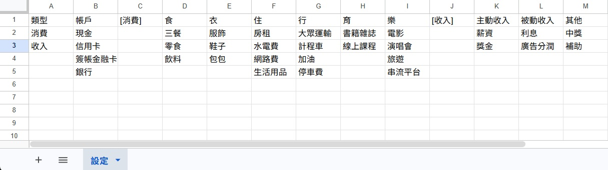
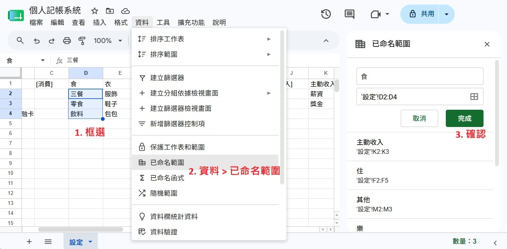
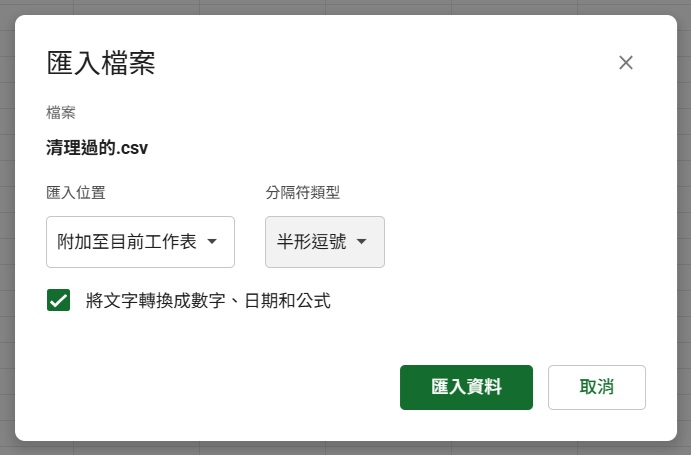
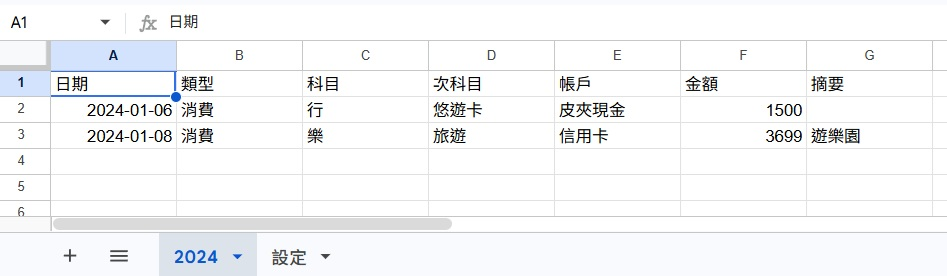
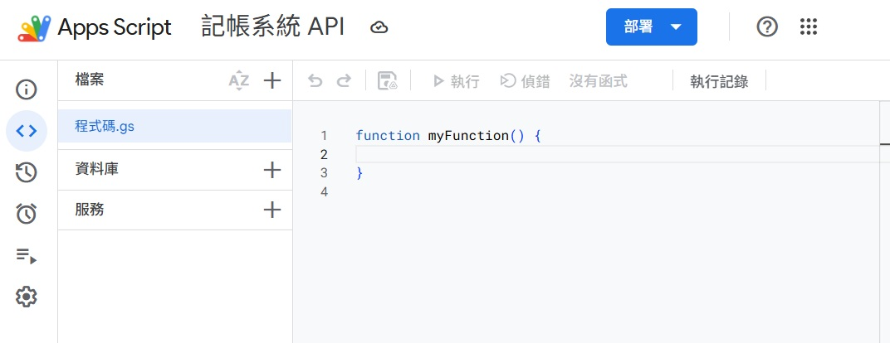
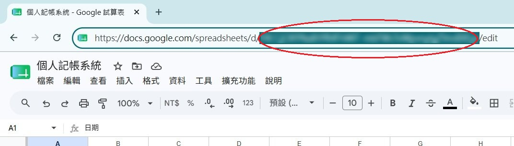
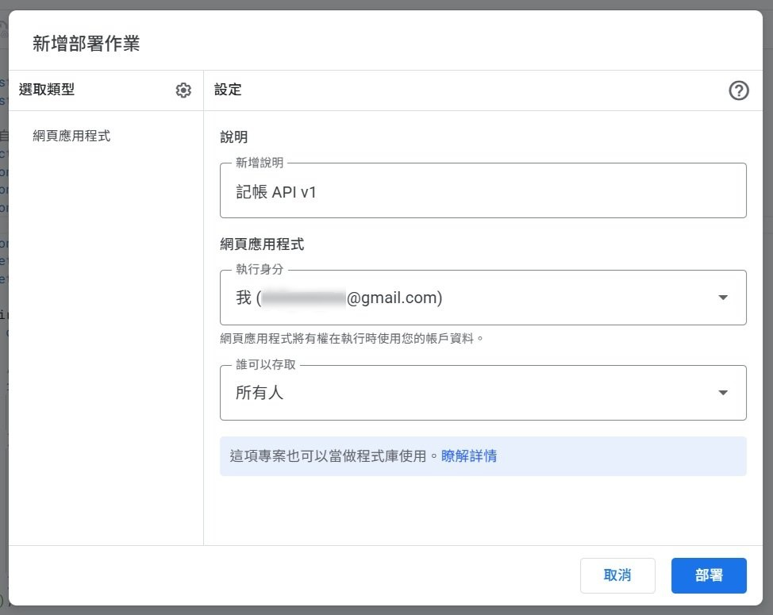
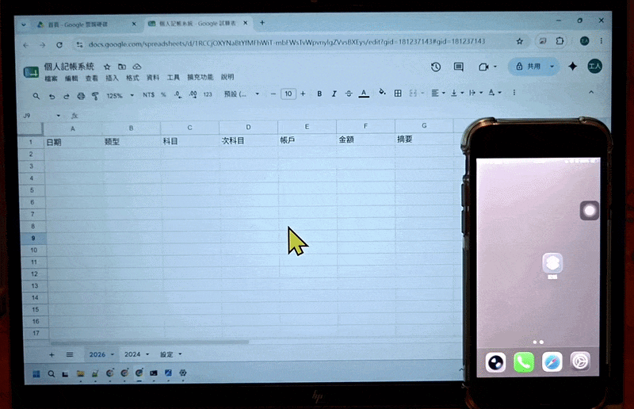

我原本一直是用一個 APP 在記帳
但想到如果哪天這個 APP 停止服務
那我過去的資料怎麼辦

於是我先把 APP 裡的資料全部匯出
接著跟 AI 研究怎麼做一套簡單的系統

後來架構決定是
- Google Sheets：存放所有記帳資料
- Apps Script：當作後端 API，處理資料寫入與查詢
- iPhone 捷徑：作為前端輸入介面，快速新增支出紀錄

中間卡最久的是 iPhone 捷徑
因為要一個一個動作自己新增
而且 AI 跟我講的動作名稱常常找不到
例如 AI 說 `詢問輸入`，結果其實叫 `要求輸入`
還有 AI 說 `從清單中選擇`，但應該叫 `從列表中選擇`
而且還有什麼 `鍵` `值` 都搞不懂
抱怨完了XD，就趕快開始吧 😆

## 建立 Google Sheet 結構

### 建立工作表與欄位
1. 前往 [Google Sheets](https://sheets.google.com/) 建立新檔案
2. 將試算表重新命名為「個人記帳系統」
3. 將預設的「工作表1」重新命名為「設定」
4. 在「設定」分頁輸入以下欄位:

金錢流向類型
- A1: `類型`
- A2~A3: `消費`、`收入`

資金來源帳戶
- B1: `帳戶`
- B2~B5: `現金`、`信用卡`、`簽帳金融卡`、`銀行`

消費科目標記 (Apps Script 自動偵測用)
- C1: `[消費]`

消費科目與次科目
- D1~I1: `食`、`衣`、`住`、`行`、`育`、`樂`
- D2~D4: `三餐`、`零食`、`飲料`
- E2~E4: `服飾`、`鞋子`、`包包`
- F2~F5: `房租`、`水電費`、`網路費`、`生活用品`
- G2~G5: `大眾運輸`、`計程車`、`加油`、`停車費`
- H2~H3: `書籍雜誌`、`線上課程`
- I2~I5: `電影`、`演唱會`、`旅遊`、`串流平台`

收入科目標記 (Apps Script 自動偵測用)
- J1: `[收入]`

收入科目與次科目
- K1~M1: `主動收入`、`被動收入`、`其他`
- K2~K3: `薪資`、`獎金`
- L2~L3: `利息`、`廣告分潤`
- M2~M3: `中獎`、`補助`

完成後長這樣 👇

<div align="center"></div>

### 建立命名範圍
為了讓 Apps Script 可以動態抓取
要幫每個科目的次科目建立「命名範圍」
這樣抓「食」就能知道底下的「三餐、零食、飲料」

1. 框選「食」的次科目範圍
2. 點選上方選單: 「資料」 → 「已命名範圍」
3. 在右側面板中：
    - 名稱輸入: `食`
    - 範圍確認為: `'設定'!D2:D4`
    - 點擊「完成」


<div align="center"></div>

重複此步驟，為每個科目建立命名範圍：
- 衣 → `'設定'!E2:E4`
- 住 → `'設定'!F2:F5`
- 行 → `'設定'!G2:G5`
- 育 → `'設定'!H2:H3`
- 樂 → `'設定'!I2:I5`
- 主動收入 → `'設定'!K2:K3`
- 被動收入 → `'設定'!L2:L3`
- 其他 → `'設定'!M2:M3`

這裡我踩到了一個坑 🕳️
消費跟支出都有一個叫 `其他` 的科目
但不能重複命名
所以最後改成 `消費其他`、`收入其他`


### 匯入舊資料
接下來要把以前的資料匯進去
從 APP 匯出的 CSV 欄位是

```
"日期","類型","科目","帳戶","金額","摘要",
"2024-06-03","消費","行-悠遊卡","現金","1200","",
"2024-06-05","消費","樂-旅遊","信用卡","3699","遊樂園",
```

發現科目跟次科目在同一欄位
於是先用 Python 清理資料
把它們拆成不同欄位

```
科目 → 科目,次科目
行-悠遊卡 → 行,悠遊卡
```

接著回到 Google Sheet
1. 新增年份的分頁，例如 `2024`
2. 點選 `A1` 儲存格，上方選單「檔案」→「匯入」
3. 選擇 「上傳」，把清理好的 CSV 上傳
4. 匯入位置 →「附加到目前工作表」
分隔符類型 →「半形逗號」
點「匯入資料」

<div align="center"></div>

重複以上步驟，把每年的 CSV 匯入對應分頁

<div align="center"></div>

## Apps Script 開發

### 撰寫程式碼

1. 點擊上方選單「擴充功能」→「Apps Script」
2. 將專案重新命名為「記帳系統 API」

<div align="center"></div>

3. 刪除預設的 `myFunction()` 程式碼
4. 貼上完整程式碼

```
const SHEET_ID = '你的試算表ID'; // 記得改成你的ID
const CONFIG_SHEET = '設定';

// 自動偵測消費和收入的科目範圍
function getCategoryRanges() {
  const ss = SpreadsheetApp.openById(SHEET_ID);
  const sheet = ss.getSheetByName(CONFIG_SHEET);
  const firstRow = sheet.getRange('1:1').getValues()[0];
  
  const ranges = {};
  let currentType = null;
  let startCol = null;
  
  firstRow.forEach((cell, index) => {
    const col = index + 1;
    
    // 找到標記
    if (cell === '[消費]') {
      currentType = '消費';
      startCol = col + 1; // 科目從下一欄開始
    } else if (cell === '[收入]') {
      // 儲存消費範圍
      if (currentType === '消費' && startCol) {
        const endCol = col - 1;
        ranges['消費'] = sheet.getRange(1, startCol, 1, endCol - startCol + 1);
      }
      currentType = '收入';
      startCol = col + 1;
    }
  });
  
  // 儲存收入範圍（到最後）
  if (currentType === '收入' && startCol) {
    const lastCol = firstRow.length;
    // 找到收入的最後一個有值的欄位
    let endCol = startCol;
    for (let i = startCol; i <= lastCol; i++) {
      if (firstRow[i - 1]) endCol = i;
    }
    ranges['收入'] = sheet.getRange(1, startCol, 1, endCol - startCol + 1);
  }
  
  return ranges;
}

function doGet(e) {
  const action = e.parameter.action;

  let result;
  if (action === 'getConfig') {
    result = getConfig();
  } else {
    result = ContentService.createTextOutput('{}');
  }

  return result.setMimeType(ContentService.MimeType.JSON);
}

function doPost(e) {
  try {
    const params = JSON.parse(e.postData.contents);
    const action = params.action;
    if (action === 'addEntry') return addEntry(params);
    return ContentService.createTextOutput(JSON.stringify({ success: false, error: 'unknown action', action: action }))
      .setMimeType(ContentService.MimeType.JSON);
  } catch(err) {
    return ContentService.createTextOutput(JSON.stringify({ success: false, error: err.toString() }))
      .setMimeType(ContentService.MimeType.JSON);
  }
}

function getConfig() {
  const ss = SpreadsheetApp.openById(SHEET_ID);
  const sheet = ss.getSheetByName(CONFIG_SHEET);
  const data = sheet.getDataRange().getValues();
  const headers = data[0];

  const config = {
    帳戶: [],
    類型: [],
    消費科目: [],  // 陣列
    收入科目: [],  // 陣列
    次科目: {}
  };

  headers.forEach((header, colIndex) => {
    if (!header) return;
    
    // 跳過標記欄位
    if (header === '[消費]' || header === '[收入]') return;
    
    const values = [];
    for (let row = 1; row < data.length; row++) {
      if (data[row][colIndex]) values.push(data[row][colIndex]);
    }
    
    if (header === '帳戶') {
      config.帳戶 = values;
    } else if (header === '類型') {
      config.類型 = values;
    } else {
      // 判斷是消費還是收入科目
      let categoryType = '消費';
      for (let i = colIndex - 1; i >= 0; i--) {
        if (headers[i] === '[收入]') {
          categoryType = '收入';
          break;
        } else if (headers[i] === '[消費]') {
          categoryType = '消費';
          break;
        }
      }
      
      // 加入陣列（保持順序）
      if (categoryType === '消費') {
        config.消費科目.push(header);
      } else {
        config.收入科目.push(header);
      }
      
      // 儲存次科目
      config.次科目[header] = values;
    }
  });

  return ContentService.createTextOutput(JSON.stringify(config))
    .setMimeType(ContentService.MimeType.JSON);
}

function addEntry(data) {
  const ss = SpreadsheetApp.openById(SHEET_ID);
  
  // 從日期取年份
  let year;
  if (data.date) {
    const dateStr = String(data.date);
    if (dateStr.includes('-')) {
      year = dateStr.split('-')[0];
    } else if (dateStr.includes('/')) {
      year = dateStr.split('/')[0];
    } else {
      year = new Date().getFullYear().toString();
    }
  } else {
    year = new Date().getFullYear().toString();
  }
  
  let sheet = ss.getSheetByName(year);

  if (!sheet) {
    sheet = ss.insertSheet(year);
    sheet.appendRow(['日期', '類型', '科目', '次科目', '帳戶', '金額', '摘要']);
  }

  sheet.appendRow([
    data.date,
    data.type,
    data.category,
    data.subcategory,
    data.account,
    data.amount,
    data.note
  ]);

  const lastRow = sheet.getLastRow();
  
  // 先為新增的這一行設定驗證
  updateTypeValidation(sheet, lastRow);
  updateCategoryValidation(sheet, lastRow);
  updateSubcategoryValidation(sheet, lastRow);
  updateAccountValidation(sheet, lastRow);
  
  // 再排序
  if (lastRow > 2) {
    sheet.getRange(2, 1, lastRow - 1, 7).sort({ column: 1, ascending: true });
  }

  return ContentService.createTextOutput(JSON.stringify({ success: true }))
    .setMimeType(ContentService.MimeType.JSON);
}

// === 連動下拉選單功能 ===

// 當編輯儲存格時觸發
function onEdit(e) {
  const sheet = e.source.getActiveSheet();
  const range = e.range;
  
  // 跳過設定分頁和統計分頁
  if (sheet.getName() === CONFIG_SHEET || sheet.getName() === '統計') return;
  
  const col = range.getColumn();
  const row = range.getRow();
  
  // 處理類型欄（B 欄）的變更 → 更新科目
  if (col === 2) {
    updateCategoryValidation(sheet, row);
    updateSubcategoryValidation(sheet, row);
  }
  
  // 處理科目欄（C 欄）的變更 → 更新次科目
  if (col === 3) {
    updateSubcategoryValidation(sheet, row);
  }
}

// 設定類型的驗證
function updateTypeValidation(sheet, row) {
  const typeCell = sheet.getRange(row, 2); // B 欄：類型
  
  try {
    const ss = SpreadsheetApp.openById(SHEET_ID);
    const configSheet = ss.getSheetByName(CONFIG_SHEET);
    const range = configSheet.getRange('A2:A3'); // 類型範圍
    
    const rule = SpreadsheetApp.newDataValidation()
      .requireValueInRange(range, true)
      .setAllowInvalid(false)
      .build();
    typeCell.setDataValidation(rule);
  } catch (err) {
    Logger.log('updateTypeValidation error: ' + err);
  }
}

// 根據類型更新科目的驗證
function updateCategoryValidation(sheet, row) {
  const typeCell = sheet.getRange(row, 2); // B 欄：類型
  const categoryCell = sheet.getRange(row, 3); // C 欄：科目
  const type = typeCell.getValue();
  const currentCategory = categoryCell.getValue();
  
  // 如果類型欄是空的，清除科目驗證和內容
  if (!type) {
    categoryCell.clearDataValidations();
    categoryCell.clearContent();
    return;
  }
  
  try {
    const ranges = getCategoryRanges();
    const range = ranges[type];
    
    if (!range) {
      categoryCell.clearDataValidations();
      categoryCell.clearContent();
      return;
    }
    
    // 取得有效的科目清單
    const validCategories = range.getValues()[0].filter(v => v !== '');
    
    // 如果當前科目不在新範圍內，清除內容
    if (currentCategory && !validCategories.includes(currentCategory)) {
      categoryCell.clearContent();
    }
    
    // 設定新的驗證
    const rule = SpreadsheetApp.newDataValidation()
      .requireValueInRange(range, true)
      .setAllowInvalid(false)
      .build();
    categoryCell.setDataValidation(rule);
  } catch (err) {
    Logger.log('updateCategoryValidation error: ' + err);
  }
}

// 根據科目更新次科目的驗證
function updateSubcategoryValidation(sheet, row) {
  const categoryCell = sheet.getRange(row, 3); // C 欄：科目
  const subcategoryCell = sheet.getRange(row, 4); // D 欄：次科目
  const category = categoryCell.getValue();
  const currentSubcategory = subcategoryCell.getValue();
  
  // 如果科目欄是空的，清除次科目驗證和內容
  if (!category) {
    subcategoryCell.clearDataValidations();
    subcategoryCell.clearContent();
    return;
  }
  
  // 嘗試從命名範圍取得次科目清單
  try {
    const ss = SpreadsheetApp.openById(SHEET_ID);
    const namedRange = ss.getNamedRanges().find(nr => nr.getName() === category);
    
    if (namedRange) {
      const range = namedRange.getRange();
      const validValues = range.getValues().flat().filter(v => v !== '');
      
      // 如果次科目不在新範圍內，清除內容
      if (currentSubcategory && !validValues.includes(currentSubcategory)) {
        subcategoryCell.clearContent();
      }
      
      // 設定新的驗證
      const rule = SpreadsheetApp.newDataValidation()
        .requireValueInRange(range, true)
        .setAllowInvalid(false)
        .build();
      subcategoryCell.setDataValidation(rule);
    } else {
      // 找不到對應的命名範圍，清除驗證和內容
      subcategoryCell.clearDataValidations();
      subcategoryCell.clearContent();
    }
  } catch (err) {
    Logger.log('updateSubcategoryValidation error: ' + err);
  }
}

// 設定帳戶的驗證
function updateAccountValidation(sheet, row) {
  const accountCell = sheet.getRange(row, 5); // E 欄：帳戶
  
  try {
    const ss = SpreadsheetApp.openById(SHEET_ID);
    const configSheet = ss.getSheetByName(CONFIG_SHEET);
    const range = configSheet.getRange('B2:B6'); // 帳戶範圍
    
    const rule = SpreadsheetApp.newDataValidation()
      .requireValueInRange(range, true)
      .setAllowInvalid(false)
      .build();
    accountCell.setDataValidation(rule);
  } catch (err) {
    Logger.log('updateAccountValidation error: ' + err);
  }
}

// 手動執行：為整個工作表設定所有驗證（批次版，更快）
function setupAllValidations() {
  const ss = SpreadsheetApp.openById(SHEET_ID);
  const sheets = ss.getSheets();
  const categoryRanges = getCategoryRanges();
  const configSheet = ss.getSheetByName(CONFIG_SHEET);
  
  sheets.forEach(sheet => {
    // 跳過設定分頁和統計分頁
    if (sheet.getName() === CONFIG_SHEET || sheet.getName() === '統計') return;
    
    const lastRow = sheet.getLastRow();
    if (lastRow < 2) return; // 只有標題列
    
    Logger.log(`處理分頁: ${sheet.getName()}, ${lastRow - 1} 筆資料`);
    
    // === 批次設定類型驗證 ===
    
    const typeRange = configSheet.getRange('A2:A3');
    const typeRule = SpreadsheetApp.newDataValidation()
      .requireValueInRange(typeRange, true)
      .setAllowInvalid(false)
      .build();
    
    for (let row = 2; row <= lastRow; row++) {
      sheet.getRange(row, 2).setDataValidation(typeRule);
    }
    
    // === 批次設定科目驗證 ===
    
    // 先清除 C 欄所有驗證
    sheet.getRange(2, 3, lastRow - 1, 1).clearDataValidations();
    
    // 取得所有類型值
    const types = sheet.getRange(2, 2, lastRow - 1, 1).getValues().flat();
    
    // 按類型分組
    const typeGroups = { '消費': [], '收入': [] };
    types.forEach((type, index) => {
      const row = index + 2;
      if (typeGroups[type]) {
        typeGroups[type].push(row);
      }
    });
    
    // 為每個類型批次設定科目驗證
    Object.keys(typeGroups).forEach(type => {
      const rows = typeGroups[type];
      if (rows.length === 0) return;
      
      const range = categoryRanges[type];
      if (!range) return;
      
      const rule = SpreadsheetApp.newDataValidation()
        .requireValueInRange(range, true)
        .setAllowInvalid(false)
        .build();
      
      // 批次設定這個類型的所有行
      rows.forEach(row => {
        sheet.getRange(row, 3).setDataValidation(rule);
      });
    });
    
    // === 批次設定次科目驗證 ===
    
    // 先清除 D 欄所有驗證
    sheet.getRange(2, 4, lastRow - 1, 1).clearDataValidations();
    
    // 取得所有科目值
    const categories = sheet.getRange(2, 3, lastRow - 1, 1).getValues().flat();
    
    // 按科目分組
    const categoryGroups = {};
    categories.forEach((cat, index) => {
      const row = index + 2;
      if (!cat) return;
      if (!categoryGroups[cat]) categoryGroups[cat] = [];
      categoryGroups[cat].push(row);
    });
    
    // 為每個科目批次設定次科目驗證
    Object.keys(categoryGroups).forEach(category => {
      const rows = categoryGroups[category];
      const namedRange = ss.getNamedRanges().find(nr => nr.getName() === category);
      
      if (namedRange) {
        const range = namedRange.getRange();
        const rule = SpreadsheetApp.newDataValidation()
          .requireValueInRange(range, true)
          .setAllowInvalid(false)
          .build();
        
        // 批次設定這個科目的所有行
        rows.forEach(row => {
          sheet.getRange(row, 4).setDataValidation(rule);
        });
      }
    });
    
    // === 批次設定帳戶驗證 ===
    
    const accountRange = configSheet.getRange('B2:B6');
    const accountRule = SpreadsheetApp.newDataValidation()
      .requireValueInRange(accountRange, true)
      .setAllowInvalid(false)
      .build();
    
    for (let row = 2; row <= lastRow; row++) {
      sheet.getRange(row, 5).setDataValidation(accountRule);
    }
  });
  
  Logger.log('所有驗證設定完成！');
}
```

5. 將程式碼第一行的 `SHEET_ID` 改成你的試算表 ID
ID 怎麼找呢？
先回到 Google Sheet
就是網址中 `/d/` 和 `/edit` 之間的文字

<div align="center"></div>

6. 點擊上方的「儲存專案」圖示

<div align="center"></div>

### 部署程式碼

1. 點擊右上角「部署 → 新增部署作業」
    - 點擊「選取類型」旁的齒輪圖示 → 選擇「網頁應用程式」
    - 說明 →`記帳 API v1`
    - 執行身分 → `我`
    - 具有存取權的使用者 → `所有人`
    - 點擊「部署」

<div align="center"></div>

2. 點擊「授予存取權」
    - 點「Advanced」(或「顯示詳細資訊」)
    - 點最下面「Go to ... (unsafe)」(或「前往 ...(不安全)」)
    - 然後按「Continue」(或「繼續」)

<div align="center"></div>

部署完成後
有一個 `部署作業 ID`
記得先複製起來
等一下做捷徑會用到

## iPhone 捷徑設定

### 建立捷徑

1. 在 iPhone 上開啟「捷徑」App
2. 點擊右上角的「+」建立新捷徑
3. 點擊上方「新捷徑」改名為「記帳」

### 新增動作

【輸入日期】

1. 搜尋並新增「格式化日期」
    - 日期選擇「每次都詢問」
    - 展開之後，日期格式：選「自訂」
    - 格式化字串：輸入 `yyyy-MM-dd`
2. 新增「設定變數」
    - 變數名稱輸入 `日期`
    - 變數設為「格式化的日期」

【輸入金額】

3. 新增「要求輸入」
    - 提示輸入 `金額`
    - 後面類型改成要求「數字」
4. 新增「設定變數」
    - 變數名稱輸入 `金額`
    - 變數設為「要求輸入」

【載入設定】

5. 新增「取得 URL 內容」
    - URL 輸入 `https://script.google.com/macros/s/你的ID/exec?action=getConfig`
    (`你的ID` 改成 `部署作業 ID`)
    - 展開之後，方式：選「GET」

6. 新增「設定變數」
    - 變數名稱輸入 `設定資料`
    - 變數設為「URL 內容」

【選擇類型】

7. 新增「取得辭典值」
    - 鍵值輸入 `類型`
    - 一整句長這樣: 在「設定資料」中取得 `類型` 的「數值」
8. 新增「從列表中選擇」
    - 展開之後，提示輸入 `選擇類型`
    - 一整句長這樣: 從「辭典值」中選擇
9. 新增「設定變數」
    - 變數名稱輸入 `類型`
    - 一整句長這樣: 將 `類型` 變數設為「所選擇的項目」

【選擇帳戶】

10. 新增「取得辭典值」
    - 把類型變數刪掉，改「設定資料」變數
    - 鍵值輸入 `帳戶`
    - 一整句長這樣: 在「設定資料」中取得 `帳戶` 的「數值」
11. 新增「從列表中選擇」
    - 展開之後，提示輸入 `選擇帳戶`
    - 一整句長這樣: 從「辭典值」中選擇
12. 新增「設定變數」
    - 變數名稱輸入  `帳戶`
    - 一整句長這樣: 將 `帳戶` 變數設為「所選擇的項目」

【根據類型取得科目清單】

13. 新增「如果」
    - 把檔案大小變數刪掉，改「類型」變數
    - (我在這步卡很久🕳️) 
       - 點一下「類型」下面會跳出選單
       - 點一下「文字」會展開類型選單，先點「文章」再點回「文字」，「包含任何數值」就自動變成「是任何」
       - 把 `任何` 改成 `消費` 就成功了！
    - 一整句長這樣: 如果「類型」是 `消費`

    看不懂的話，我有錄一小段操作 👇

    <details>
        <summary style="cursor: pointer;">點我打開圖片</summary>
        <div align="center"></div>
    </details>

14. 新增「取得辭典值」，長按移到在「如果」下面
    - 把帳戶變數刪掉，改「設定資料」變數
    - 鍵值輸入 `消費科目`
    - 一整句長這樣: 在「設定資料」中取得 `消費科目` 的數值
15. 新增「取得辭典值」，長按移到在「否則」下面
    - 把帳戶變數刪掉，改「設定資料」變數
    - 鍵值輸入 `收入科目`
    - 一整句長這樣: 在「設定資料」中取得 `收入科目` 的數值

【選擇科目】

16. 新增「從列表中選擇」
    - 展開選項後，提示輸入 `選擇科目`
    - 一整句長這樣: 從「如果結果」中選擇

17. 新增「設定變數」
    - 變數名稱輸入 `科目`
    - 一整句長這樣: 將 `科目` 變數設為「所選擇的項目」

【選擇次科目】

18. 新增「取得辭典值」
    - 把科目變數刪掉，改「設定資料」變數
    - 鍵值輸入 `次科目`
    - 一整句長這樣: 在「設定資料」中取得 `次科目` 的「數值」
19. 新增「取得辭典值」
    - 鍵值選擇「科目」變數
    👆 注意「科目」是變數，不是手動輸入的文字
    - 一整句長這樣: 在「辭典值」中取得「科目」的「數值」


20. 新增「從列表中選擇」
    - 展開選項後，提示輸入 `選擇次科目`
    - 一整句長這樣:在「辭典值」中選擇
21. 新增「設定變數」
    - 變數名稱輸入 `次科目`
    - 一整句長這樣: 將 `次科目` 變數設為「所選的項目」

【輸入摘要】

22. 新增「要求輸入」
    - 提示輸入 `摘要 (選填)`
    - 後面類型選擇要求「文字」
23. 新增「設定變數」
    - 變數名稱輸入 `摘要`
    - 一整句長這樣: 將 `摘要` 變數設為「要求輸入」

【送出資料】

24. 新增「取得 URL 內容」
    - 把摘要變數刪除，URL 輸入`https://script.google.com/macros/s/你的ID/exec`
    (`你的ID` 改成 `部署作業 ID`)
    - 展開之後，方式：選「POST」
    - 要求內文選「JSON」
    - 點擊「加入新欄位」，選「文字」，依序加入以下 8 個：

| 鍵值 (皆手動輸入) | 文字 |
|---|---|
| `action` | `addEntry` (手動輸入) |
| `date` | `日期` (變數) |
| `type` | `類型` (變數) |
| `category` | `科目` (變數) |
| `subcategory` | `次科目` (變數) |
| `account` | `帳戶` (變數) |
| `amount` | `金額` (變數) |
| `note` | `摘要` (變數) |

【顯示結果】

25. 新增「取得辭典值」
    - 鍵值輸入 `success`
    - 一整句長這樣: 在「URL 內容」中取得 `success` 的「數值」
26. 新增「如果」
    - (我在這步卡很久🕳️) 
    - 先點藍字「檔案大小」，下面會跳出選單，點「文字」會展開類型選單
    - 往下滑，選擇「布林值」即可
    - 一整句長這樣: 如果「辭典值」
27. 新增「顯示通知」，長按移到在「如果」下面
    - (這裡我也卡了一下🕳️) 不知道怎麼把普通文字跟變數放在一起
    - 先把辭典值變數刪除，手動輸入文字 `$ 記帳成功！`
    - 再把游標點到 `$` 後面，選取「金額」變數
    - 一整句長這樣: 顯示通知 `$「金額」記帳成功！`

28. 新增「顯示通知」，長按移到在「否則」下面
    - 跟上個步驟一樣，先把辭典值變數刪掉
    - 手動輸入文字 `$ 記帳失敗，請重試！`
    - 再把游標點到 `$` 後面，插入「金額」變數
    - 一整句長這樣: 顯示通知 `$「金額」記帳失敗，請重試！`

完成這 28 個步驟後，全部長這樣 👇

<details>
    <summary style="cursor: pointer;">點我打開圖片 (超長)</summary>
    <div align="center"></div>
</details>

### 測試捷徑

1. 點擊左上角「返回」，回到捷徑 APP 首頁
2. 點擊「記帳」捷徑
3. 依序選擇
    - 日期
    - 金額
    - 類型 (消費或收入)
    - 帳戶 (現金或信用卡...)
    - 科目 (食衣住...)
    - 次科目
    - 摘要
4. 點擊「完成」
5. 應該會顯示 `$金額 記帳成功！`
6. 檢查 Google Sheet 是否有新增一筆資料

### 加入主畫面

1. 長按「記帳」捷徑
2. 點「詳細資訊」
3. 點「加入主畫面」
4. 自訂圖示和名稱
5. 點擊「加入」

之後就能從主畫面一鍵開啟記帳！

<div align="center"></div>

### 下載捷徑

- iPhone 捷徑範本連結: https://www.icloud.com/shortcuts/b7bfbee2ac8a454695315496e726785a

記得修改 `步驟 5` & `步驟 24`
`你的ID` 要改成 `部署作業 ID`
一起來記帳吧 ( ´▽` )ﾉ
